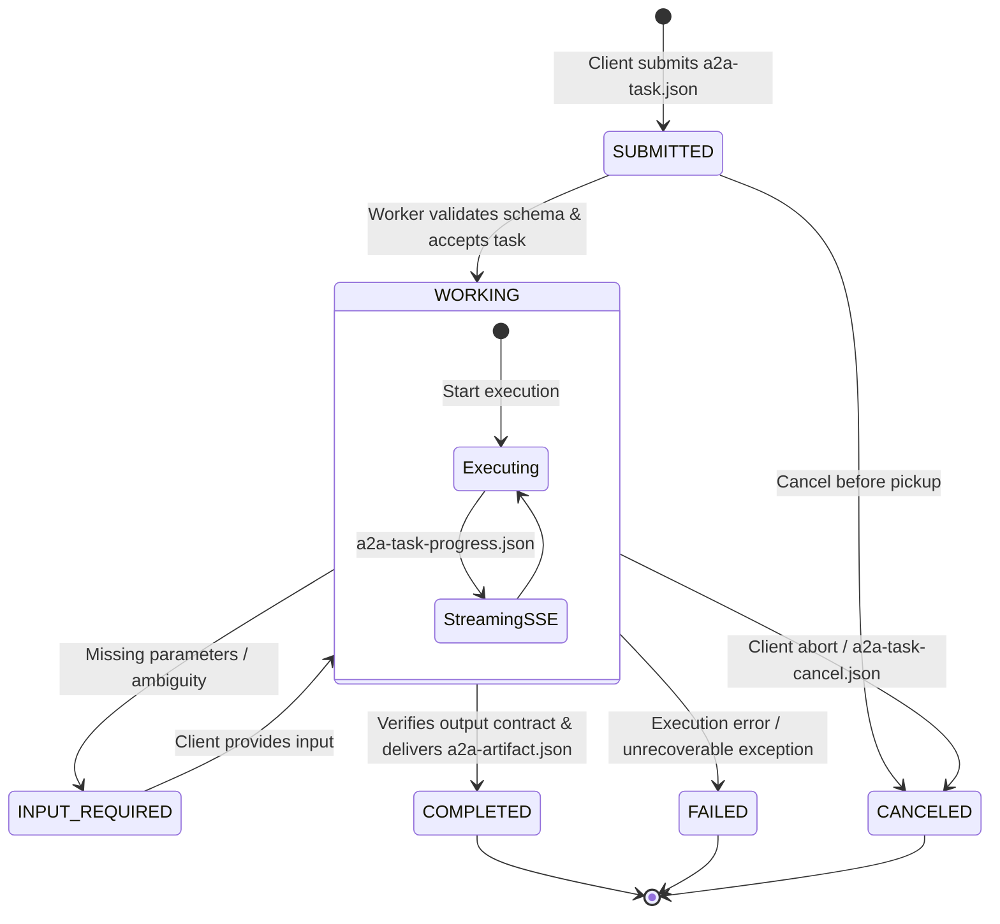

# A2A Protocol & Multi-Agent Architecture

This directory contains the **Agent-to-Agent (A2A) Protocol v1.0.1** implementation, canonical discovery endpoints, and generated agent cards for the `agent-skills` engineering pack (Pack Version **5.0.0**).

Governed under the **Agentic AI Foundation (AAIF)** — a Linux Foundation collaborative project alongside MCP, AGENTS.md, goose, and agentgateway — the A2A protocol defines open, vendor-neutral specifications for autonomous agent discovery, multi-turn task negotiation, state synchronization, and verifiable handoffs.

---

## Horizontal vs Vertical Architecture: A2A vs MCP

Modern agentic systems separate concerns across two orthogonal protocol layers:

```
┌─────────────────────────────────────────────────────────────────────────┐
│                      HORIZONTAL COORDINATION (A2A)                      │
│   Autonomous Agent-to-Agent Delegation, Multi-Turn Stateful Tasks,     │
│   Lifecycle State Machine, SSE Streaming Events, Contract Handoffs      │
└────────────────────────────────────┬────────────────────────────────────┘
                                     │ (Delegates tasks to specialized roles)
┌────────────────────────────────────▼────────────────────────────────────┐
│                       PORTABLE ROLES & AGENT CARDS                      │
│   34 Distinct Role Definitions (Primary / Supporting Skill Toolboxes)    │
└────────────────────────────────────┬────────────────────────────────────┘
                                     │ (Executes skills using tools)
┌────────────────────────────────────▼────────────────────────────────────┐
│                        VERTICAL INTEGRATION (MCP)                       │
│   Model Context Protocol: Stateless Tool Execution, File System Access, │
│   Database Queries, API Gateways, Shell Terminals (mcp-tool-map.yaml)   │
└─────────────────────────────────────────────────────────────────────────┘
```

* **Model Context Protocol (MCP)**: Vertical integration between an LLM agent and local/remote tools or resources.
* **Agent-to-Agent Protocol (A2A)**: Horizontal orchestration between autonomous agents, preserving context, contracts, and role boundaries across hops.

---

## Discovery Endpoints & Directory Layout

```
core/a2a/
├── README.md                          # This architecture specification
├── .well-known/
│   ├── agent-card.json                # Canonical pack-level Agent Card (IANA permanent URI)
│   ├── agent-registry.json            # Internal registry cataloging all 34 role cards
│   ├── ai-catalog.json                # Google AI Catalog 2026 meta-index (ARD standard)
│   └── role-skill-index.json          # Machine-readable skill/role index for client runtime
└── registry/
    ├── agent-coordinator.agent-card.json
    ├── backend-developer.agent-card.json
    ├── ... (34 per-role Agent Cards)
    └── vietnam-accounting-specialist.agent-card.json
```

### Canonical Discovery Paths
1. **`/.well-known/agent-card.json`**: Self-describing IANA well-known manifest representing the entire `agent-skills` pack as an orchestrating multi-agent service.
2. **`/.well-known/ai-catalog.json`**: Meta-index for Agentic Resource Discovery (ARD), linking A2A agents, registries, and MCP tool maps in a single crawlable endpoint.
3. **`/.well-known/agent-registry.json`**: Index of individual specialized role cards available for local or remote invocation.

---

## A2A 1.0 Task State Machine

Tasks dispatched between agents strictly adhere to the A2A 1.0 lifecycle states:



### Protocol State Enums
* Formal A2A v1.0 wire enums: `TASK_STATE_SUBMITTED`, `TASK_STATE_WORKING`, `TASK_STATE_INPUT_REQUIRED`, `TASK_STATE_COMPLETED`, `TASK_STATE_FAILED`, `TASK_STATE_CANCELED`.
* Pack-local aliases: `submitted`, `working`, `input-required`, `completed`, `failed`, `canceled`.

---

## Complete Schemas Inventory (11 Contracts)

All A2A interactions are validated against strict JSON schemas located under `core/contracts/schemas/`:

| Schema | File Name | Purpose & Trigger |
| :--- | :--- | :--- |
| **Agent Card** | `agent-card.json` | Discovery manifest defining identity, skills, auth schemes, and schemas. |
| **Task Delegation** | `a2a-task.json` | Submit, delegate, or partition work across agents with input data and messages. |
| **Task Status** | `a2a-task-status.json` | Query or return task state, progress, and result metadata. |
| **Task Progress** | `a2a-task-progress.json` | SSE streaming events (`task.created`, `task.status`, `task.message`, `task.artifact`, etc.). |
| **Task Cancellation** | `a2a-task-cancel.json` | Explicit cancellation request with reason and timeout parameters. |
| **Task Message** | `a2a-message.json` | Conversational message parts (`text`, `file`, `data` per v1.0 Part model). |
| **Task Artifact** | `a2a-artifact.json` | Final worker deliverable carrying structured output conforming to task schema. |
| **JSON-RPC Envelope** | `a2a-jsonrpc-envelope.json` | JSON-RPC 2.0 wire protocol wrapper for HTTP requests and responses. |
| **Push Notification** | `a2a-push-notification-config.json` | Webhook callback configuration for asynchronous completion alerts. |
| **Distributed Trace** | `agent-trace-span.json` | OpenTelemetry-compatible span tracing across multi-agent delegation hops. |
| **Coordination Plan** | `coordination-plan.json` | Multi-phase DAG execution plan emitted by `agent-coordinator`. |

---

## Wire Protocol & Invocation

### 1. JSON-RPC 2.0 Task Invocation (`a2a-jsonrpc-envelope.json`)
```json
{
  "jsonrpc": "2.0",
  "id": "req-984210a4",
  "method": "agent.invoke",
  "params": {
    "task": {
      "task_id": "550e8400-e29b-41d4-a716-446655440000",
      "interaction_mode": "batch",
      "target_role": "backend-developer",
      "skill_id": "add-api-endpoint",
      "input_data": {
        "endpoint": "/api/v1/metrics",
        "method": "GET"
      },
      "output_schema_ref": "feature-ticket.json"
    }
  }
}
```

### 2. SSE Streaming Progress (`a2a-task-progress.json`)
```text
event: task.status
data: {"task_id":"550e8400-e29b-41d4-a716-446655440000","state":"TASK_STATE_WORKING","progress_pct":45,"message":"Generating OpenAPI endpoint routes"}

event: task.artifact
data: {"task_id":"550e8400-e29b-41d4-a716-446655440000","artifact_id":"art-123","schema_ref":"implementation-result.json","data":{"status":"ok"}}
```

---

## Multi-Agent Orchestration Patterns

1. **Hierarchical Orchestration (`agent-coordinator`)**:
   The `agent-coordinator` ingests complex user requests, decomposes deliverables, and generates a `coordination-plan.json` breaking work into dependency-ordered slices dispatched to specialized roles.
2. **Scatter-Gather Parallelism**:
   Multiple independent tasks (e.g., simultaneous frontend and backend tasks, or multi-topic research) are dispatched concurrently; results are aggregated upon artifact validation.
3. **Sequential Pipeline**:
   Linear progression across distinct roles (e.g., `business-analyst` -> `technical-architect` -> `technical-lead` -> `frontend-developer` -> `reviewer` -> `qa-engineer`).

---

## Standard 2026 Alignment

This file is part of the agent-skills engineering pack. The 2026 upgrade
pass added this footer so every prose file in the pack carries a
consistent Standard 2026 pointer.

- **OWASP ASI**: applied as described in `core/roles/role-standard.md`
  (ASI01-ASI10) and the per-skill `## Security Guardrails (OWASP ASI)` sections.
- **Failure Modes**: the rule in this file can be violated by drift, missing
  context, or untracked exceptions. Concrete failure scenarios belong in the
  related skill or workflow's `### Failure Modes` section.
- **Output Contracts**: structured artifacts produced under this file must
  conform to schemas in `core/contracts/schemas/`.
- **Skill Toolbox Lock**: this file's rules are enforced by the role that
  owns the affected action; the runtime gate is
  `core/scripts/hooks/check-policy.py`.
- **Commit / publish gate**: changes that affect user-visible behavior
  follow the META-RULE in `core/rules/code.md` — no commit, no push, no
  publish without explicit user confirmation.

Last updated: 2026-09-10
