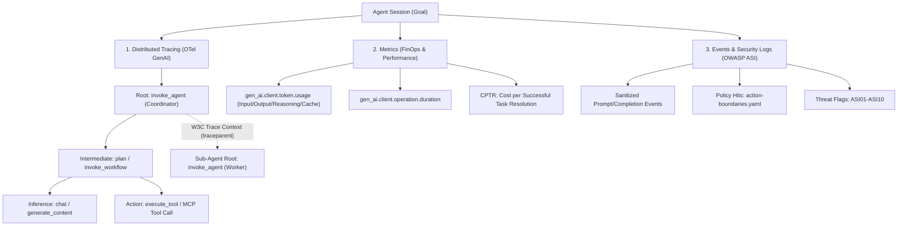

# Agent Observability Architecture (OpenTelemetry GenAI 2026/2027)

This directory houses the observability architecture, telemetry standards, and collector configurations for multi-agent systems and tools in the `agent-skills` pack.

---

## 1. The Three Pillars of Agent Observability

Agent observability goes beyond traditional microservice monitoring or simple single-turn LLM inference metrics. Agent failures are causal chains across multi-step execution graphs. Observability is structured across three pillars:



1. **Distributed Traces (Spans)**:
   - Nested causal hierarchy: `invoke_agent` $\rightarrow$ `plan` $\rightarrow$ `chat` / `generate_content` $\rightarrow$ `execute_tool`.
   - Cross-agent trace propagation via **W3C Trace Context** (`traceparent`, `tracestate`) across HTTP, JSON-RPC, and asynchronous message queues.
2. **Metrics**:
   - Standard GenAI instruments: `gen_ai.client.token.usage` (token histograms partitioned by type: input, output, reasoning/thinking, cache read, cache creation), `gen_ai.client.operation.duration`, `gen_ai.agent.turns`, `gen_ai.agent.tool_calls`.
   - FinOps KPI: **CPTR (Cost per Successful Task Resolution)**.
3. **Events & Structured Audit Logs**:
   - State transition logs, policy evaluation results (`allowed`, `requires_approval`, `denied`), and OWASP ASI security alerts.

---

## 2. Directory Contents

| Resource | Purpose |
|----------|---------|
| [`otel-genai.md`](otel-genai.md) | **Primary Specification**: Complete mapping of OpenTelemetry GenAI Semantic Conventions (operations, tokens, MCP attributes, metrics, cost attribution, and A2A W3C propagation). |
| [`otel-collector-config.template.yaml`](otel-collector-config.template.yaml) | **Production Collector Template**: OpenTelemetry Collector configuration featuring tail-based sampling (100% errors/outliers, 5% nominal) and automated PII/secret redaction. |
| `spans/` | Local directory for session JSONL trace logs generated by runtime hooks (`log-trace-span.py`). **Ignored by git** to protect local context paths. |

---

## 3. Schema Contract

Lightweight schema for all session trace spans:
- Schema: [`core/contracts/schemas/agent-trace-span.json`](../contracts/schemas/agent-trace-span.json)
- Validated by: `python3 core/scripts/validate-contracts.py`

Required fields for every span:
- `trace_id`: 32 hex characters (W3C standard)
- `span_id`: 16 hex characters
- `role`: Canonical role slug (e.g. `agent-coordinator`, `backend-developer`)
- `operation`: Valid `gen_ai.operation.name` enum (`invoke_agent`, `execute_tool`, `chat`, `generate_content`, `plan`, `invoke_workflow`)
- `status`: `ok`, `error`, or `unset`

Optional/Extended fields:
- `span_kind`: `INTERNAL`, `SERVER`, `CLIENT`, `PRODUCER`, `CONSUMER`
- `parent_span_id`: Span ID of the caller (for nested sub-agents and tool calls)
- `resource`: Service name and pack version
- `attributes`: `model`, `input_tokens`, `output_tokens`, `reasoning_tokens`, `cache_read_tokens`, `cache_creation_tokens`, `finish_reasons`, `cost_usd`, `error_type`, `task_id`, `tool_name`

---

## 4. MCP (Model Context Protocol) Observability

For MCP tool servers and clients, traces record the full interaction lifecycle per `open-telemetry/semantic-conventions-genai`:

- Initialization: `mcp.method.name = "initialize"`, `mcp.server.name`, `mcp.server.version`, `mcp.protocol.version`.
- Discovery: `mcp.method.name = "tools/list"`.
- Execution: `gen_ai.operation.name = "execute_tool"`, `mcp.method.name = "tools/call"`, `mcp.tool.name`, `mcp.session.id`, `mcp.request.id`.

---

## 5. Security & Privacy Guardrails (OWASP ASI)

Trace data is subject to `core/policies/data-classification.yaml`:

- **Never capture secrets**: Passwords, API tokens, bearer keys, and private certificates must never appear in span attributes or unredacted event messages.
- **Redaction by default**: The collector template [`otel-collector-config.template.yaml`](otel-collector-config.template.yaml) applies regex masking for credentials and auth headers before exporting to telemetry backends.
- **OWASP ASI Telemetry**:
  - `ASI01 (Goal Hijack)`: Tag deviations between initial task description and intermediate sub-agent objectives.
  - `ASI03 (Privilege Abuse)`: Capture policy violations evaluated by `check-policy.py`.
  - `ASI06 (Memory & Context Poisoning)`: Trace provenance of all context injected from RAG or external tools.
  - `ASI07 (Inter-Agent Untrusted Data)`: Trace schema validation outcomes across cross-agent boundaries.

---

## 6. Quick Start & Integration

### A. Emitting Spans via CLI / Runtime Hook

```bash
AGENT_SKILLS_ROOT=$(pwd) \
  AGENT_ACTIVE_ROLE=backend-developer \
  CURSOR_TOOL_NAME=execute_command \
  CURSOR_TOOL_ACTION="Run unit tests" \
  AGENT_MODEL="claude-3-7-sonnet" \
  GEN_AI_USAGE_INPUT_TOKENS=1250 \
  GEN_AI_USAGE_OUTPUT_TOKENS=340 \
  GEN_AI_USAGE_REASONING_TOKENS=120 \
  python3 core/scripts/hooks/log-trace-span.py
```

Spans are appended to `core/observability/spans/<trace_id>.jsonl`.

### B. Validating Spans against Schema

```bash
python3 core/scripts/validate-contracts.py
```

### C. Deploying OpenTelemetry Collector

```bash
# 1. Copy collector template
cp core/observability/otel-collector-config.template.yaml otel-collector-config.yaml

# 2. Run collector (otelcol-contrib)
otelcol-contrib --config=otel-collector-config.yaml
```

---

## 7. Related Resources

- OTel GenAI Guide: [`core/observability/otel-genai.md`](otel-genai.md)
- Agent Observability Skill: [`core/skills/agent/agent-observability/SKILL.md`](../skills/agent/agent-observability/SKILL.md)
- A2A Protocol Specification: [`core/a2a/README.md`](../a2a/README.md)
- Data Classification Policy: [`core/policies/data-classification.yaml`](../policies/data-classification.yaml)
- Action Boundaries: [`core/policies/action-boundaries.yaml`](../policies/action-boundaries.yaml)

---

## Standard 2026 Alignment

This file is part of the agent-skills engineering pack. The 2026 upgrade
pass added this footer so every prose file in the pack carries a
consistent Standard 2026 pointer.

- **OWASP ASI**: applied as described in `core/roles/role-standard.md`
  (ASI01-ASI10) and the per-skill `## Security Guardrails (OWASP ASI)` sections.
- **Failure Modes**: the rule in this file can be violated by drift, missing
  context, or untracked exceptions. Concrete failure scenarios belong in the
  related skill or workflow's `### Failure Modes` section.
- **Output Contracts**: structured artifacts produced under this file must
  conform to schemas in `core/contracts/schemas/`.
- **Skill Toolbox Lock**: this file's rules are enforced by the role that
  owns the affected action; the runtime gate is
  `core/scripts/hooks/check-policy.py`.
- **Commit / publish gate**: changes that affect user-visible behavior
  follow the META-RULE in `core/rules/code.md` — no commit, no push, no
  publish without explicit user confirmation.

Last updated: 2026-09-10
