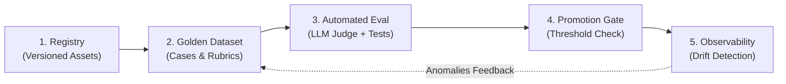

# PromptOps & Context Engineering Architecture (2026/2027 Standards)

This directory serves as the centralized repository for versioned prompt assets, golden evaluation fixtures, and PromptOps standards within the `agent-skills` pack.

---

## 1. The PromptOps Philosophy

In 2026/2027, prompt engineering for autonomous agent systems has evolved from ad-hoc text tuning into a disciplined software engineering practice (**PromptOps**):

- **Prompts are code**: Prompt assets are versioned, modular, and tracked with semantic change logs.
- **Context over phrasing**: Output quality is driven by context engineering (MCP tool context, dynamic RAG injection, and memory state) rather than syntactic instruction tricks.
- **Evaluation-driven development**: No prompt is deployed or promoted to production without passing rigorous evaluation against curated golden datasets.
- **Continuous Virtuous Cycle**: Production anomalies and edge-case failures are sanitized and fed back into evaluation datasets to permanently prevent regressions.

---

## 2. The 5-Stage PromptOps Lifecycle



1. **Registry (`prompts/`)**: Versioned prompt templates declared with metadata manifests, target roles, and owned skills.
2. **Golden Datasets (`prompts/golden/`)**: Representative test cases covering nominal workflows, edge cases, and adversarial guardrails.
3. **Automated Evaluation**: Multi-faceted testing:
   - Programmatic token assertion (`must_include`, `must_not_include`, `required_tokens`, `forbidden_tokens`).
   - JSON Schema contract conformance validation against `core/contracts/schemas/`.
   - LLM-as-a-Judge semantic rubric scoring for open-ended generation.
4. **Promotion Gates**: Gating deployment based on minimum pass rate thresholds ($\ge 90\%-95\%$) and statistical significance testing ($p < 0.05$).
5. **Production Observability & Drift Detection**:
   - Tracking semantic output drift via cosine similarity of embedding centroids.
   - Tracing token usage and latency via OpenTelemetry GenAI Semantic Conventions (`core/observability/`).

---

## 3. Context Engineering & Programmatic Optimization

Modern agent skills leverage programmatic prompt optimization:

- **DSPy Integration**: Using typed signatures, Teleprompters, and **MIPROv2** (Multi-prompt Instruction Proposal and Optimization) to systematically optimize prompt instructions and few-shot demonstrations against target metrics.
- **Model Context Protocol (MCP)**: Decoupling tools and data sources from static instructions; dynamically injecting tool definitions and resource context via standardized MCP endpoints.
- **A/B Testing**: Controlled canary deployments of prompt revisions to measure impact on resolution accuracy and Cost per Successful Task Resolution (CPTR).

---

## 4. Current Golden Prompt Datasets

The pack maintains 5 production evaluation fixtures (58 total test cases) under [`golden/`](golden/):

| Asset ID | Target Role | Target Skill | Output Contract | Min Pass Rate | Cases |
|----------|-------------|--------------|-----------------|---------------|-------|
| [`a2a-coordination`](golden/a2a-coordination/manifest.yaml) | `agent-coordinator` | `agent-a2a-protocol` | `coordination-plan.json` | 95% | 10 |
| [`agent-coordinator-phase-gate`](golden/agent-coordinator-phase-gate/manifest.yaml) | `agent-coordinator` | `agent-a2a-protocol` | `coordination-plan.json` | 90% | 18 |
| [`security-audit`](golden/security-audit/manifest.yaml) | `security-engineer` | `security-audit` | `security-audit.json` | 95% | 10 |
| [`payment-integration`](golden/payment-integration/manifest.yaml) | `ecommerce-engineer` | `integrate-payment-gateway` | `api-contract-spec.json` | 95% | 10 |
| [`code-refactoring`](golden/code-refactoring/manifest.yaml) | `technical-lead` | `review-code` | `implementation-result.json` | 90% | 10 |

---

## 5. Automated CI Validation

Every prompt asset and evaluation fixture is verified by the pack's continuous integration gates:

```bash
# Validate all golden evaluation manifests and test case pairs:
python3 core/scripts/validate-golden-evals.py
```

The validator verifies:
- Manifest schema version, prompt slug, version, target role, and target skill.
- Existence of target role and skill in core registries.
- Case file pairing (`NNN-input.json` and `NNN-expected.json`) with minimum 10 cases per asset.
- JSON syntax validity and non-empty assertion rubrics.
- Resolution of referenced output contract schemas against `core/contracts/schemas/`.

---

## 6. Related Resources

- **PromptOps Skill**: [`core/skills/agent/agent-prompt-lifecycle/SKILL.md`](../skills/agent/agent-prompt-lifecycle/SKILL.md)
- **Authoring Guidelines**: [`core/prompts/golden/README.md`](golden/README.md)
- **A2A Protocol**: [`core/a2a/README.md`](../a2a/README.md)
- **Observability Architecture**: [`core/observability/README.md`](../observability/README.md)

---

## Standard 2026 Alignment

This file is part of the agent-skills engineering pack. The 2026 upgrade
pass added this footer so every prose file in the pack carries a
consistent Standard 2026 pointer.

- **OWASP ASI**: applied as described in `core/roles/role-standard.md`
  (ASI01-ASI10) and the per-skill `## Security Guardrails (OWASP ASI)` sections.
- **Failure Modes**: the rule in this file can be violated by drift, missing
  context, or untracked exceptions. Concrete failure scenarios belong in the
  related skill or workflow's `### Failure Modes` section.
- **Output Contracts**: structured artifacts produced under this file must
  conform to schemas in `core/contracts/schemas/`.
- **Skill Toolbox Lock**: this file's rules are enforced by the role that
  owns the affected action; the runtime gate is
  `core/scripts/hooks/check-policy.py`.
- **Commit / publish gate**: changes that affect user-visible behavior
  follow the META-RULE in `core/rules/code.md` — no commit, no push, no
  publish without explicit user confirmation.

Last updated: 2026-09-10
