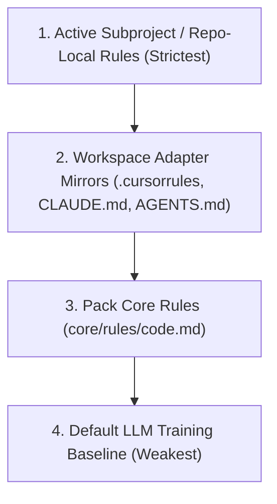

# Core Rules System (Engineering Pack Standards 2026/2027)

This directory defines the **always-on global invariants** and governance standards that govern every agent and developer interaction across all supported tools and environments.

---

## 1. Single Source of Truth

The canonical source of truth for all global rules is:
- **[`code.md`](code.md)** — minimal, language-agnostic global rules covering safety gates, Policy-as-Code, environment protection, and code comment hygiene.

Every agent adapter at the repository root mirrors this rule set to ensure unified behavior regardless of which IDE or CLI is driving the session:
- `.cursorrules` (legacy Cursor)
- `.cursor/rules/agent-skills.md` (Cursor 2026 `.mdc` format)
- `CLAUDE.md` (Claude Code CLI / extension)
- `AGENTS.md` (Antigravity & portable agent guide)
- `.github/copilot-instructions.md` (GitHub Copilot)
- `.kiro/steering/agent-skills.md` (Kiro steering)
- `.kilocode/rules/agent-skills.md` (Kilo Code)

---

## 2. Rule Precedence Hierarchy

When multiple layers of rules apply to an active workspace, agents resolve directives in strict order of precedence:



1. **Repo-Local Rules**: Strictest. If a subproject (e.g. `leaseinvietnam/`, `maylanhtreotuong/`) defines local guidelines or collections schemas, those override defaults.
2. **Adapter Mirrors**: The IDE-specific mirrors providing platform hooks and environment wiring.
3. **Pack Core Rules (`core/rules/code.md`)**: The foundational safety and operational invariants.
4. **Non-Weakening Principle**: Subproject rules may add domain-specific constraints or stricter rules, but **may never weaken** the pack's safety invariants (e.g., cannot bypass commit approval gates or permit secret exposure).

---

## 3. The 9 Adapter Parity Groups

The test script [`core/scripts/validate-rules.py`](../scripts/validate-rules.py) automatically enforces 100% parity across all adapter files for the following 9 governance groups:

| Parity Group | Key Phrases Required | Intent & Enforcement |
|--------------|----------------------|----------------------|
| **`rule_source`** | `core/rules/code.md` | Ensures every adapter links back to the central source of truth. |
| **`meta_rule`** | `Before finalizing any response or executing a command`, `halt and ask the user` | Requires active pre-execution verification against rules on every turn. |
| **`approval_gates`** | `create a commit unless the user explicitly confirms`, `push`, `publish`, `Ensure all code changes pass local linters` | Prevents automated git commits, pushes, releases, or dirty code landing without explicit human sign-off. |
| **`artifact_safety`** | `expose secrets`, `mention agents, AI workflow`, `Prefer repo-local standards` | Protects credentials and forbids polluting git logs/changelogs with internal AI metadata. |
| **`env_file_protection`** | `.dev.vars`, `.env`, `.gitignore` | Hard-blocks committing local environment secrets. |
| **`local_override`** | `Repo-local rules override these defaults` | Formally codifies the precedence hierarchy. |
| **`comment_hygiene`** | `Prefer no comment over comments that merely restate the code`, `within 3 lines` | Prevents LLM verbose comment bloat; enforces concise implementation comments ($\le 3$ lines). |
| **`role_enforcement`** | `role-standard`, `Skill Toolbox`, `core responsibilities` | Locks agents to designated Primary skills and halts out-of-scope work. |
| **`workflow_discipline`** | `checklist`, `ONE step at a time`, `Role:` | Requires step-by-step execution and role tagging for all pack workflows. |
| **`policy_enforcement`** | `action-boundaries.yaml`, `data-classification.yaml` | Bridges natural language rules to automated Policy-as-Code gatekeepers. |

---

## 4. Policy-as-Code Integration

Prose rules are backed by deterministic code enforcement via:
- [`core/policies/action-boundaries.yaml`](../policies/action-boundaries.yaml) — Role-based permission matrix (`allowed`, `requires_approval`, `denied`).
- [`core/policies/data-classification.yaml`](../policies/data-classification.yaml) — Data confidentiality tiers (`public`, `internal`, `confidential`, `restricted`).
- [`core/policies/mcp-tool-map.yaml`](../policies/mcp-tool-map.yaml) — Tool-to-action identifier mapping.
- [`core/scripts/hooks/check-policy.py`](../scripts/hooks/check-policy.py) — Runtime gatekeeper executed in pre-tool hooks (exit codes: `0 = allowed`, `1 = denied`, `2 = requires_approval`).

---

## 5. Verification Commands

To verify that all rule sources and adapter mirrors maintain 100% parity:

```bash
python3 core/scripts/validate-rules.py
```

---

## Standard 2026 Alignment

This file is part of the agent-skills engineering pack. The 2026 upgrade
pass added this footer so every prose file in the pack carries a
consistent Standard 2026 pointer.

- **OWASP ASI**: applied as described in `core/roles/role-standard.md`
  (ASI01-ASI10) and the per-skill `## Security Guardrails (OWASP ASI)` sections.
- **Failure Modes**: the rule in this file can be violated by drift, missing
  context, or untracked exceptions. Concrete failure scenarios belong in the
  related skill or workflow's `### Failure Modes` section.
- **Output Contracts**: structured artifacts produced under this file must
  conform to schemas in `core/contracts/schemas/`.
- **Skill Toolbox Lock**: this file's rules are enforced by the role that
  owns the affected action; the runtime gate is
  `core/scripts/hooks/check-policy.py`.
- **Commit / publish gate**: changes that affect user-visible behavior
  follow the META-RULE in `core/rules/code.md` — no commit, no push, no
  publish without explicit user confirmation.

Last updated: 2026-09-10
