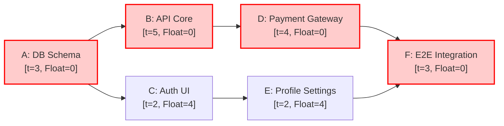

# User Story Mapping & Critical Path Method (CPM) Scheduling

> Authoritative reference guide for Jeff Patton User Story Mapping, Walking Skeleton definition, MoSCoW release slicing, and Critical Path Method (CPM) analysis.

---

## 1. Jeff Patton User Story Mapping Architecture

A User Story Map organizes a two-dimensional visual grid representing user experience over time.

```
 HORIZONTAL AXIS: Chronological Narrative Flow (Left to Right)
 ┌───────────────────┬───────────────────┬───────────────────┐
 │ Activity 1: Find  │ Activity 2: Select│ Activity 3: Pay   │  ◄── THE BACKBONE
 └─────────┬─────────┴─────────┬─────────┴─────────┬─────────┘
           │                   │                   │
 ┌─────────▼─────────┬─────────▼─────────┬─────────▼─────────┐
 │ Step 1.1: Search  │ Step 2.1: Compare │ Step 3.1: Card Pay│  ◄── WALKING SKELETON
 └───────────────────┴───────────────────┴───────────────────┘
═══════════════════════════════════════════════════════════════  ◄── SLICE 1: MVP
 ┌───────────────────┬───────────────────┬───────────────────┐
 │ Story: Filter tag │ Story: Side-by-side│ Story: Apple Pay │  ◄── SLICE 2: Release 1.1
 └───────────────────┴───────────────────┴───────────────────┘
═══════════════════════════════════════════════════════════════  ◄── SLICE 3: Release 2.0
 ┌───────────────────┬───────────────────┬───────────────────┐
 │ Story: AI Suggest │ Story: 3D Preview │ Story: Crypto Pay │  ◄── Future Slices
 └───────────────────┴───────────────────┴───────────────────┘
 VERTICAL AXIS: Sophistication & Release Priority (Top to Bottom)
```

### Key Principles
1. **The Backbone**: High-level activities that never change (e.g. Discover, Configure, Purchase, Track).
2. **The Walking Skeleton**: The simplest implementation that connects all backbone activities from start to finish without breaking. It provides immediate integration testing and user feedback.
3. **Slice Vertically, Not Horizontally**: Avoid building 100% of the search engine while checkout has not started. Slice thin across all steps.

---

## 2. Critical Path Method (CPM) Dependency Scheduling

Critical Path Method calculates the shortest possible project duration and identifies which tasks have zero schedule flexibility.

### Key Terms & Formulas
- **Duration ($t$)**: Estimated working days to complete the task.
- **Early Start ($ES$)**: The earliest possible time a task can begin. $ES = \max(EF_{\text{predecessors}})$.
- **Early Finish ($EF$)**: The earliest possible completion. $EF = ES + t$.
- **Late Finish ($LF$)**: The latest time a task can complete without delaying project launch. $LF = \min(LS_{\text{successors}})$.
- **Late Start ($LS$)**: The latest time a task can begin. $LS = LF - t$.
- **Total Float (Slack)**: $\text{Float} = LS - ES = LF - EF$.
- **Critical Path**: The longest sequence of tasks from project start to end where **$\text{Float} = 0$**.

### Worked CPM Network Example



- **Critical Path**: `A` (3d) → `B` (5d) → `D` (4d) → `F` (3d) = **15 Days**.
- **Non-Critical Path**: `A` (3d) → `C` (2d) → `E` (2d) → `F` (3d) = **10 Days**.
- Tasks `C` and `E` have **4 days of Float**. Delaying task `C` by 2 days will NOT delay the project. Delaying task `B` by even 1 day directly delays the launch by 1 day.

---

## 3. Story Map to A2A Delivery Handoff Contract

When exporting story map cards to Engineering and Business Analysis squads, use the following structured Markdown or JSON representation:

```markdown
### Story Card: [STORY-ID] [Story Title]
- **Backbone Activity**: [Activity Name]
- **Release Slice**: MVP / Release 1.1 / Release 2.0
- **MoSCoW Priority**: Must / Should / Could / Won't
- **User Story**:
  - As a [target actor]
  - I want to [execute action]
  - So that [realize business or personal value]
- **Dependencies (Predecessors)**: [STORY-XYZ, API-ABC]
- **Critical Path Task?**: Yes (Float = 0) / No (Float = N days)
- **Acceptance Criteria (Given-When-Then)**:
  - Scenario 1: Successful execution
    - Given [precondition]
    - When [trigger event]
    - Then [verifiable outcome]
- **Downstream Ticket Mapping**: `contracts/schemas/feature-ticket.json`
```
