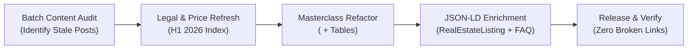
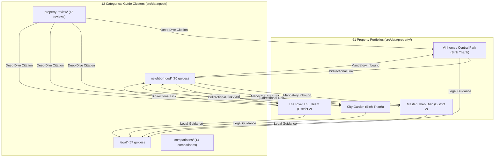
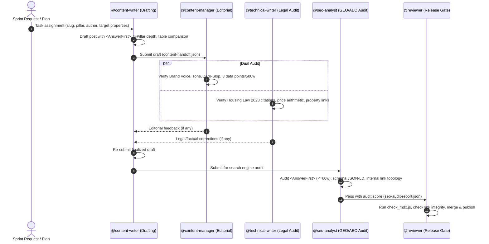

# Lease in Vietnam Content & SEO Team Pack (`lease-team`)

> **Master Operating Standard & Multi-Agent Swarm for Lease in Vietnam (`leaseinvietnam.com`).**  
> **Pack Version**: 5.0.0 · **Schema Version**: "2" · **Baseline Snapshot**: 2026-09-19 · **Manifest**: [manifest.yaml](manifest.yaml)

---

## 1. Executive Overview & Operating Philosophy

The `lease-team` pack composes the portable engineering core with `overlays/lease-content` and `overlays/seo-publishing` to govern content production, SEO engineering, and technical publishing for **Lease in Vietnam** ([leaseinvietnam.com](https://leaseinvietnam.com)). 

Lease in Vietnam is the definitive English-language real estate, legal advisory, and relocation authority portal for expatriates, multinational executives, digital nomads, and diplomatic personnel living or investing in Vietnam.

```
┌─────────────────────────────────────────────────────────────────────────────────────────┐
│                      LEASE IN VIETNAM PUBLISHING ECOSYSTEM                              │
├─────────────────────────────────────────────────────────┬───────────────────────────────┤
│ Astro v5 High-Speed Edge Frontend                       │ Cloudflare Pages Edge Engine  │
├─────────────────────────────────────────────────────────┼───────────────────────────────┤
│ Content Collections:                                    │ Deployment: Cloudflare Edge   │
│ - 463 Long-Form Posts (12 Categorical Clusters)         │ Global Latency: <50ms         │
│ - 61 Luxury Property Portfolios                         │ Core Web Vitals: 100/100      │
│ - 98 Verified E-E-A-T Author Personas                   │ Framework: Astro v5.12+ SSR   │
│ Total Corpus: 1,548,527 Words · 100% AnswerFirst        │ Design: Tailwind CSS v3.4     │
└──────────────────────────┬──────────────────────────────┴───────────────────────────────┘
                           │
                           │   5-PILLAR CONTENT ARCHITECTURE
                           ▼
┌─────────────────────────────────────────────────────────────────────────────────────────┐
│ 1. Intelligence │ 2. Information │ 3. Insights │ 4. Neighborhoods │ 5. Integration      │
└─────────────────────────────────────────────────────────────────────────────────────────┘
```

### 1.1 Technical Stack & Infrastructure
- **Static & SSR Engine**: Astro v5 (`^5.12.9`) utilizing Content Collections (`src/data/post` and `src/data/property`).
- **Edge Deployment**: Cloudflare Pages via `@astrojs/cloudflare` with strict worker mode and edge asset caching.
- **Styling & Assets**: Tailwind CSS, `@astrojs/sitemap`, `@astrojs/rss`, `@astrolib/seo`, and custom SVG icon sprites.
- **Performance Thresholds**:
  - Largest Contentful Paint (LCP) $\le 1.2\text{s}$.
  - Cumulative Layout Shift (CLS) $\le 0.01$.
  - First Input Delay / Interaction to Next Paint (INP) $\le 100\text{ms}$.

---

## 2. The 5-Pillar Expat Housing Content Framework

Every piece of content created or upgraded by the swarm must strictly map to one of the 5 Strategic Pillars:

| # | Pillar Name | Core Domain Scope | Typical Categorical Hubs | Target Persona & Value Proposition |
|---|---|---|---|---|
| **1** | **Intelligence** | Market data, rental indexes, quarterly yield reports, macro infrastructure impact (Metro Line 1, Ring Road 3). | `market-data`, `market-radar` | C-level expats, institutional investors, and HR mobility directors requiring empirical rental data. |
| **2** | **Information** | Vietnam Housing Law 2023, Decree 95/2024/ND-CP, bilingual lease contracts, deposit escrow, eviction laws, TRC/Visa rules. | `legal`, `scam`, `trust-safety` | New expat arrivals needing bulletproof legal protection and contract verification templates. |
| **3** | **Insights** | Unbiased property assessments, construction build quality, soundproofing tests, management board (BQT) performance. | `property-review`, `comparisons` | Expat tenants deciding between specific luxury developments without broker bias. |
| **4** | **Neighborhoods** | Micro-neighborhood livability audits, walkability scores, flood risk topography, international school bus routes. | `neighborhood`, `neighborhood-comparison` | Families and professionals choosing between Thao Dien, An Phu, Thu Thiem, Tay Ho, and Ciputra. |
| **5** | **Integration** | Cultural norms in landlord negotiations, utility bill payment flows, maid/service contracts, emergency contacts. | `living`, `guides`, `travel` | Settling-in guide for expatriates transitioning into long-term Vietnamese residency. |

---

## 3. 2026/2027 GEO/AEO & AI Search Standards

In 2026 and 2027, search behavior is dominated by generative AI engines (Google AI Overviews, Perplexity, Claude, ChatGPT Search). The `lease-team` mandates strict architectural compliance with Generative Engine Optimization (GEO) and Answer Engine Optimization (AEO):

### 3.1 The Mandatory `<AnswerFirst>` Component
Every single post (`100%` coverage across 463 posts) must begin immediately below the H1 title with an `<AnswerFirst>` callout:

```astro
<AnswerFirst>
  <strong>Direct Rental Answer:</strong> Renting a 2-bedroom apartment in Thao Dien (District 2) in 2026 ranges from $950 to $1,800/month depending on compound age and furnishing tier. Standard security deposits require exactly 2 months' gross rent, held under Decree 95/2024/ND-CP regulations. Lease agreements for foreigners require certified bilingual notarization to be legally enforceable in Vietnamese courts.
</AnswerFirst>
```

**Content Rules for `<AnswerFirst>`**:
- Length: Strictly $\le 60$ words.
- Quantitative Fact Density: Must contain at least **3 verifiable data points** (price range, legal decree number, timeframe, or percentage).
- Zero Fluff: Never open with "Are you looking for...", "Vietnam is a beautiful country...", or general marketing statements.

### 3.2 Fact Density & Anti-Slop Content Gating
- **Metric Density**: Minimum 3 numerical data points (prices in USD/VND, distance in km, square meters $\text{m}^2$, decibels, or dates) per 500 words.
- **Anti-Slop Ban List**: Words strictly prohibited: *oasis, bustling, seamlessly, nestled, tapestry, vibrant, look no further, delve into, breathtaking*.
- **Bilingual Legal Grounding**: All legal advice must reference exact Vietnamese legal codes (e.g., *Article 119 of the 2023 Housing Law*, *Decree 95/2024/ND-CP on Residential Leases*).

---

## 4. The 8-Batch Empirical AEO Upgrade Discipline

The repository maintains an empirical upgrade pipeline that systematically refreshes existing posts to Masterclass grade:



- **Batches 1–8 (Completed)**: 80+ posts upgraded to Masterclass standard.
- **Batch Upgrade Checklist**:
  1. Inject `<AnswerFirst>` component at line 1 of body.
  2. Embed comparison markdown table comparing at least 3 property alternatives.
  3. Include verified landlord negotiation scripts with Vietnamese translations.
  4. Link to minimum 2 related properties in `src/data/property/`.
  5. Validate against `leaseinvietnam/check_mdx.js`.

---

## 5. Property-Post Link Equity Topology (Zero Orphan Policy)

The site structure interconnects 463 editorial guides with 61 luxury property portfolios:



### Topology Laws:
1. **Bidirectional Cohesion**: Every property file must cite its corresponding neighborhood guide. Every neighborhood guide must embed at least two property cards.
2. **Zero Orphan Constraint**: Any post or property portfolio with 0 inbound internal links is automatically blocked from staging or master merging.
3. **Outbound Affiliate Governance**: All links to external relocation services, furniture rentals, or banking partners must carry `rel="nofollow sponsored noopener"` attributes.

---

## 6. E-E-A-T Persona Authorship Architecture

The platform operates **98 verified author personas** spanning 5 specialist domains to satisfy Google's Experience, Expertise, Authoritativeness, and Trustworthiness (E-E-A-T) standards:

1. **Senior Legal Partners** (e.g., *Lawyer Tran Minh Duc*, *Lawyer Le Thu Trang*): Housing Law 2023, dispute arbitration, title deed due diligence.
2. **Tax & Financial CPAs** (e.g., *CPA Vo Thi Thanh Ha*, *Doan Minh Quan*): Rental tax declarations (Form 01/TTS), foreign remittance, security deposit escrow.
3. **Expat Relocation Directors** (e.g., *Marcus Vance*, *Elena Rostova*): International school selection, pet relocation quarantine, lease negotiations.
4. **Urban Civil Engineers** (e.g., *Eng. Nguyen Hoang Lam*, *Arch. Hoang Anh Tuan*): Soundproofing acoustic ratings, building structural integrity, HVAC ventilation.
5. **Market Intelligence Desks** (e.g., *LeaseInVietnam Market Intelligence Unit*): Statistical price tracking, rental yield calculations, infrastructure forecasts.

---

## 7. The 4-Role Swarm Pipeline

Content production and upgrades follow a structured multi-agent workflow:



---

## 8. Governance & Quality Gates

### Quality Checklist:
- [ ] Frontmatter includes title, description, pubDate, category, author, and canonicalURL.
- [ ] `<AnswerFirst>` block present at top of post ($\le 60$ words, $\ge 3$ data points).
- [ ] Minimum word count $\ge 1,800$ words for standard guides; $\ge 2,500$ words for pillar hubs.
- [ ] No prohibited AI slop terms (*oasis, nestled, seamlessly, bustling*).
- [ ] Minimum 2 internal links to properties in `src/data/property/`.
- [ ] Minimum 3 internal links to sibling guides within the same categorical pillar.
- [ ] All legal statements cite specific Articles from Vietnamese laws (Housing Law 2023, Land Law 2024).
- [ ] `check_mdx.js` exits 0 with zero syntax errors.
