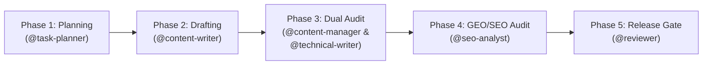

# Workflow: Publish Lease in Vietnam Content (`publish-lease-content`)

> **Workflow Version**: 5.0.0 · **Pack**: `packs/lease-team` · **Target Site**: `leaseinvietnam.com`  
> **Schema Contract**: `contracts/schemas/content-handoff.json` & `contracts/schemas/seo-audit-report.json`

---

## 1. Overview

This workflow governs the end-to-end multi-agent creation, legal vetting, GEO/AEO optimization, and edge release of editorial articles and property dossiers for the **Lease in Vietnam** platform.

---

## 2. Execution Phases

### Phase 1: Topic Selection & Keyword Strategy
- **Owner**: `@task-planner` & `@seo-analyst`
- **Inputs**: `plan/CONTENT_INDEX.md`, target search query, target expat intent (Family, Digital Nomad, Executive, Diplomat).
- **Actions**:
  1. Verify target slug does not duplicate any of the 463 existing posts.
  2. Select author persona from the 98-persona E-E-A-T registry matching subject domain.
  3. Map article to one of the 5 Pillars (Intelligence, Information, Insights, Neighborhoods, Integration).
  4. Identify at least 2 relevant property targets in `src/data/property/` for bidirectional link equity.
- **Exit Gate**: Topic Brief approved with declared author, category, pillar, and target properties.

### Phase 2: Masterclass Drafting & Answer-First Formulation
- **Owner**: `@content-writer`
- **Skill**: `write-leaseinvietnam-maylanhtreotuong-data`, `write-article`
- **Actions**:
  1. Author frontmatter with all required fields (`title`, `description`, `pubDate`, `author`, `category`, `canonicalURL`).
  2. Formulate `<AnswerFirst>` block: strictly $\le 60$ words, containing $\ge 3$ verified quantitative facts.
  3. Author comprehensive body ($\ge 1,800$ words) structured with BLUF subheadings.
  4. Embed comparison table comparing minimum 3 property developments or lease terms.
  5. Include actionable bilingual negotiation phrasebook or legal checklist.
  6. Embed bidirectional links to target `src/data/property/` files.
- **Output Artifact**: Markdown/MDX file staged in `src/data/post/{category}/{slug}.md` and `content-handoff.json`.

### Phase 3: Parallel Editorial & Legal Audit
- **Sub-phase 3A: Editorial & Tone Governance (`@content-manager`)**:
  - Scan text against Anti-Slop Ban List (*oasis, bustling, seamlessly, nestled*).
  - Check quantitative density ($\ge 3$ data points per 500 words).
  - Verify E-E-A-T author persona alignment.
- **Sub-phase 3B: Legal & Technical Factual Audit (`@technical-writer`)**:
  - Verify Vietnamese legal citations (Housing Law 2023, Decree 95/2024/ND-CP).
  - Check price calculations, currency conversion rates (USD/VND), and deposit escrow guidelines.
  - Verify property profile paths and apartment specification metrics.
- **Exit Gate**: Both auditors record approval in `content-handoff.json`.

### Phase 4: GEO/AEO & Entity Topology Audit
- **Owner**: `@seo-analyst`
- **Skill**: `optimize-seo`, `audit-content`, `implement-schema-markup`
- **Actions**:
  1. Verify `<AnswerFirst>` complies with AI Overview snippet constraints.
  2. Validate Schema.org JSON-LD graph (`Article`, `BreadcrumbList`, `RealEstateListing`).
  3. Verify zero broken relative internal links.
  4. Confirm at least 3 lateral cluster links within the same category.
- **Output Artifact**: `seo-audit-report.json`.

### Phase 5: Build Verification & Release Gating
- **Owner**: `@reviewer`
- **Actions**:
  1. Execute `node check_mdx.js` to ensure zero syntax or parser errors.
  2. Run `npm run build` or `astro check` verifying clean compilation.
  3. Validate zero orphan pages.
  4. Commit and merge to `main`.
