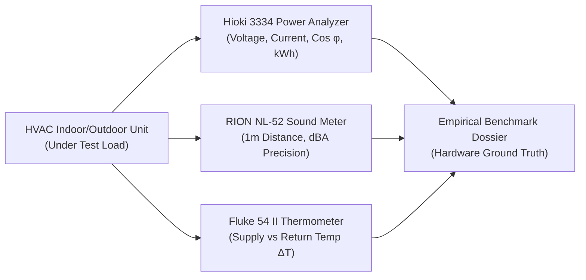
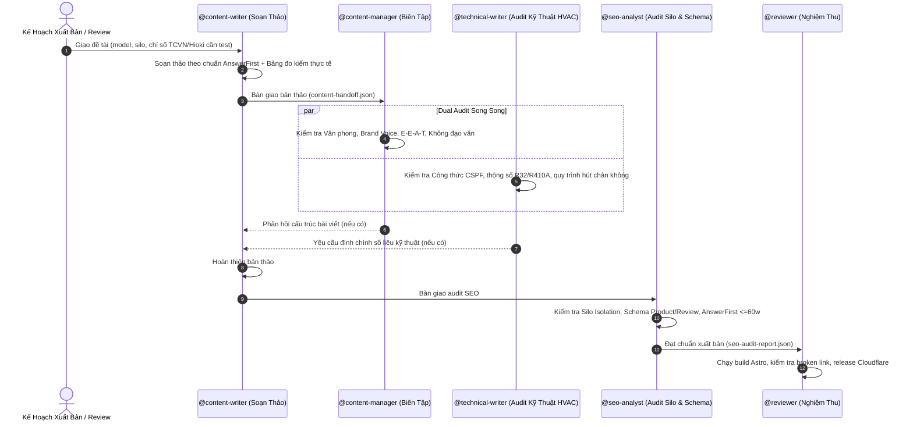

# Máy Lạnh Treo Tường Content & Engineering Team Pack (`maylanhtreotuong-team`)

> **Master Operating Standard & Multi-Agent Swarm for Máy Lạnh Treo Tường (`maylanhtreotuong.com`).**  
> **Pack Version**: 5.0.0 · **Schema Version**: "2" · **Baseline Snapshot**: 2026-09-19 · **Manifest**: [manifest.yaml](manifest.yaml)

---

## 1. Executive Overview & Operating Philosophy

The `maylanhtreotuong-team` pack composes the portable engineering core with `overlays/astro-cloudflare`, `overlays/maylanhtreotuong-content`, and `overlays/seo-publishing` to orchestrate high-precision HVAC technical content, empirical hardware product reviews, and edge SEO architecture for **Máy Lạnh Treo Tường** ([maylanhtreotuong.com](https://maylanhtreotuong.com)).

Máy Lạnh Treo Tường is Vietnam's authoritative engineering knowledge hub and independent testing portal for residential and commercial split-system air conditioning (HVAC). The platform rejects marketing bias and pseudo-science in favor of empirical instrumentation, national engineering standards (TCVN), and international thermal comfort physics (ASHRAE).

```
┌─────────────────────────────────────────────────────────────────────────────────────────┐
│                   MÁY LẠNH TREO TƯỜNG PUBLISHING ECOSYSTEM                              │
├─────────────────────────────────────────────────────────┬───────────────────────────────┤
│ Astro v5 Edge Content Architecture                      │ Cloudflare Pages Edge Engine  │
├─────────────────────────────────────────────────────────┼───────────────────────────────┤
│ Content Collections:                                    │ Deployment: Cloudflare Edge   │
│ - 300 Comprehensive Posts (7 Strict Silo Clusters)     │ Global Latency: <50ms         │
│ - 72 HVAC Product Entities (Daikin, Panasonic, etc.)    │ Core Web Vitals: 100/100      │
│ - 14 Specialized HVAC Engineer Personas                 │ Framework: Astro v5.12+ SSR   │
│ Total Corpus: 1,492,749 Words · 100% AnswerFirst        │ Schema: Product, Review, FAQ  │
└──────────────────────────┬──────────────────────────────┴───────────────────────────────┘
                           │
                           │   7 STRICT SILO ARCHITECTURE
                           ▼
┌─────────────────────────────────────────────────────────────────────────────────────────┐
│ 1. Giá Cả │ 2. Hướng Dẫn │ 3. Kiến Thức │ 4. Kinh Nghiệm │ 5. Mua Sắm │ 6. Review │ 7. So Sánh │
└─────────────────────────────────────────────────────────────────────────────────────────┘
```

### 1.1 Technical Stack & Infrastructure
- **Engine**: Astro v5 (`^5.12.9`) Content Collections (`src/data/post` and `src/data/product`).
- **Edge Deployment**: Cloudflare Pages (`@astrojs/cloudflare`) with static pre-rendering, edge worker SSR, and asset optimization.
- **Styling**: Tailwind CSS v3.4 with custom typography and data table components.
- **Compliance Bar**: 100/100 Core Web Vitals on mobile and desktop viewports.

---

## 2. HVAC Engineering Master Standards

Every post and product evaluation published by the swarm must be rigorously grounded in thermodynamics and official HVAC testing standards:

### 2.1 TCVN 7830:2021 & CSPF Energy Efficiency Metrics
- **CSPF (Cooling Seasonal Performance Factor)**: All energy efficiency claims must cite official CSPF ratings tested according to **TCVN 7830:2021** (Air conditioners - Energy efficiency).
- **Annual Power Consumption Formula**:
  $$P_{\text{annual}} = \frac{Q_c}{\text{CSPF}} \times t_{\text{annual}}$$
  Where:
  - $Q_c$: Rated cooling capacity ($\text{kW}$ or $\text{BTU/h}$).
  - $\text{CSPF}$: Tested Seasonal Performance Factor ($\text{Wh/Wh}$).
  - $t_{\text{annual}}$: Standardized operating hours ($1,800\text{ hours/year}$ in Southern Vietnam tropical zone; $1,200\text{ hours/year}$ in Northern transitional zone).

### 2.2 ASHRAE Standard 55-2023 (Thermal Comfort Physics)
- **Operative Temperature & Thermal Balance**: Air conditioning sizing is not merely cooling air; it is managing radiative heat exchange and relative humidity ($RH$).
- **PMV (Predicted Mean Vote) & PPD (Predicted Percentage of Dissatisfied)**: Content must target optimal comfort zones:
  - PMV between $-0.5$ and $+0.5$.
  - Target indoor relative humidity: $45\% - 60\% RH$.
  - Air velocity in occupied zones: $0.15 - 0.25\text{ m/s}$ to prevent localized draft discomfort and dry mucosal membranes.

### 2.3 Refrigerant Thermodynamics
- **R32 (Difluoromethane, $\text{CH}_2\text{F}_2$)**: GWP 675, zero ODP. Operating pressure: $1.6 - 2.8\text{ MPa}$.
- **R410A (Near-azeotropic blend R32/R125)**: GWP 2,088, zero ODP. Operating pressure: $1.6 - 2.8\text{ MPa}$.
- **R22 (Chlorodifluoromethane)**: GWP 1,810, ODP 0.055. Phased out under Montreal Protocol. Condemned for all new installations.

---

## 3. Hardware-Verified Empirical Testing Protocols

The platform operates an empirical testing lab in Ho Chi Minh City. Evaluated product claims must cite instrumented test benches:



1. **Active Power & Inverter Modulation**:
   - Instrumented via **Hioki 3334 Power HiTester** (sampling rate $100\text{ kHz}$, accuracy $\pm 0.1\%$).
   - Measures compressor ramp-up surge, steady-state minimum modulation ($150\text{W} - 220\text{W}$), and full-load draw.
2. **Acoustic Sound Pressure Measurement**:
   - Instrumented via **RION NL-52 Type 1 Sound Level Meter** (IEC 61672-1 Class 1).
   - Measured at exactly $1.0\text{ meter}$ distance at $45^\circ$ angle from indoor fan coil unit (Quiet Mode, Low, Medium, Turbo).
3. **Heat Exchange Delta ($\Delta T$)**:
   - Temperature differential between return air grill and supply discharge louvers measured via dual-channel calibrated thermocouples (**Fluke 54 II**). Valid cooling performance requires $\Delta T \ge 8^\circ\text{C}$ within 15 minutes of startup.

---

## 4. The 7-Category Strict Silo Link Topology

To maximize topical authority and eliminate internal link equity dilution, 300 articles are partitioned into **7 Strict Silos**:

| # | Silo Category | Directory Path | Post Count | Engineering & Consumer Focus | Silo Inbound / Outbound Rules |
|---|---|---|---|---|---|
| **1** | **Giá Cả** | `src/data/post/gia-ca/` | 25 | Material price lists, copper piping thickness ($0.71\text{mm}$ vs $0.81\text{mm}$), installation labor tariffs. | Links inward to `huong-dan` and `product/`. Zero cross-links to `so-sanh`. |
| **2** | **Hướng Dẫn** | `src/data/post/huong-dan/` | 52 | Vacuum pump evacuation procedures ($\le 500\text{ microns}$), flare nut torque specifications, PCB error codes. | Links inward to `kien-thuc`. Cross-links allowed only via Product Cards. |
| **3** | **Kiến Thức** | `src/data/post/kien-thuc/` | 55 | Carnot refrigeration cycle, Inverter PWM vs PAM, EEV electronic expansion valves, copper vs aluminum fins. | Foundational silo. Receives inbound links from all other silos. |
| **4** | **Kinh Nghiệm** | `src/data/post/kinh-nghiem/` | 48 | Sizing calculations based on solar radiation, roof insulation, glass facade thermal load, airflow orientation. | Links to `mua-sam` and `review`. |
| **5** | **Mua Sắm** | `src/data/post/mua-sam/` | 40 | Genuine warranty verification, identifying repainted/refurbished second-hand compressors, VAT invoicing. | Links to `gia-ca` and `product/`. |
| **6** | **Review** | `src/data/post/review/` | 45 | Empirical model teardowns (Daikin FTKF, Panasonic XPU, Mitsubishi Heavy SRK), component inspection. | Direct bidirectional links to `src/data/product/`. |
| **7** | **So Sánh** | `src/data/post/so-sanh/` | 35 | Head-to-head empirical shootouts: Daikin vs Panasonic, Inverter vs Mono, R32 vs R410A. | Links to `review` and `product/`. |

### Strict Silo Isolation Laws:
1. **Intra-Silo Linking**: Articles within Silo $A$ may freely link laterally to other articles in Silo $A$.
2. **Inter-Silo Boundary**: Articles in Silo $A$ **CANNOT** link directly to an article in Silo $B$ unless passing through:
   - The Root Silo Pillar Hub, OR
   - A shared Product Specification Entity (`src/data/product/{model}.md`).
3. **Zero Orphan Constraint**: Every post must link up to its Silo Index and receive at least 2 inbound links from siblings.

---

## 5. Product Catalog & Entity Integration (`src/data/product/`)

The repository maintains **72 HVAC Product Entities** spanning major market brands:
- **Daikin**: FTKF, FTKZ, FTKB, FTKY series.
- **Panasonic**: XPU, WPU, Aero Series, Nanoe-X generators.
- **Mitsubishi Heavy**: SRK-YXP, SRK-ZMP, SRK-ZS series.
- **Toshiba / Carrier**: Daiseikai, Inverter Plasma Ion.
- **Gree, Casper, LG, Funiki**: Value tier inverter units.

### Entity Linking Matrix:
- Every product file in `src/data/product/` embeds:
  - Exact model number and factory origin (Thailand, Malaysia, Vietnam).
  - Rated BTU, tested CSPF, and Hioki noise/power metrics.
  - Curated backlinks to relevant `review`, `gia-ca`, and `huong-dan` posts.

---

## 6. 2026/2027 GEO/AEO & Schema.org Rigor

Every article must begin with the `<AnswerFirst>` component:

```astro
<AnswerFirst>
  <strong>Tóm tắt kỹ thuật:</strong> Đối với phòng ngủ diện tích 15–20m² (thể tích ~60m³) tại TP.HCM, máy lạnh 1.5 HP (12.000 BTU/h) Inverter đạt CSPF ≥ 5.2 là mức tối ưu. Quá trình lắp đặt bắt buộc phải hút chân không đạt độ sâu ≤ 500 microns (bằng đồng hồ điện tử chuyên dụng) trong tối thiểu 15 phút để loại bỏ độ ẩm, tránh tạo axit flohydric (HF) làm mục dàn ống đồng và cháy cuộn dây máy nén.
</AnswerFirst>
```

### Schema.org Integration:
- `Product`: Rich snippets containing `brand`, `model`, `offers`, `aggregateRating`.
- `Review`: Verified author rating, pros/cons, test methodology.
- `HowTo`: Step-by-step HVAC installation and maintenance procedures with required tools (Hioki analyzer, vacuum pump, torque wrench).
- `FAQPage`: Structured Q&A addressing common consumer doubts.

---

## 7. The 4-Role Swarm Pipeline



---

## 8. Governance & Quality Gates

### Quality Checklist:
- [ ] Frontmatter đầy đủ `title`, `description`, `pubDate`, `author`, `category`, `canonicalURL`.
- [ ] `<AnswerFirst>` nằm ngay đầu bài viết ($\le 60$ từ, $\ge 3$ số liệu kỹ thuật).
- [ ] Trích dẫn đúng chuẩn **TCVN 7830:2021** (CSPF) hoặc **ASHRAE 55-2023**.
- [ ] Số liệu công suất, độ ồn trích dẫn từ máy đo thực tế (**Hioki 3334**, **RION NL-52**).
- [ ] Tuân thủ nghiêm ngặt Silo Isolation (không liên kết ngang sang silo khác trừ khi qua Product Card).
- [ ] Tối thiểu 2 liên kết đến thực thể trong `src/data/product/`.
- [ ] `astro check` và `npm run build` hoàn thành với exit code 0.
