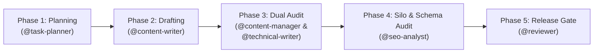

# Workflow: Publish Máy Lạnh Treo Tường Content (`publish-maylanhtreotuong-content`)

> **Workflow Version**: 5.0.0 · **Pack**: `packs/maylanhtreotuong-team` · **Target Site**: `maylanhtreotuong.com`  
> **Schema Contract**: `contracts/schemas/content-handoff.json` & `contracts/schemas/seo-audit-report.json`

---

## 1. Overview

This workflow governs the multi-agent creation, empirical HVAC engineering validation, strict Silo link enforcement, and edge release of technical articles and product teardowns for **Máy Lạnh Treo Tường**.

---

## 2. Execution Phases

### Phase 1: Silo Topic Assignment & Product Selection
- **Owner**: `@task-planner` & `@seo-analyst`
- **Inputs**: `plan/content-inventory-index-2027.md`, target HVAC user intent, target Silo directory.
- **Actions**:
  1. Assign topic to one of the 7 Strict Silos (`gia-ca`, `huong-dan`, `kien-thuc`, `kinh-nghiem`, `mua-sam`, `review`, `so-sanh`).
  2. Select author persona from the 14 specialized HVAC Engineer profiles (Kỹ sư HVAC, Kỹ sư Âm học, Kỹ sư Nhiệt Lạnh).
  3. Identify relevant product models in `src/data/product/` for entity integration.
- **Exit Gate**: Topic Brief approved with declared author, silo, model, and instrumentation test requirements.

### Phase 2: Technical Drafting & Empirical Testbed Inclusion
- **Owner**: `@content-writer`
- **Skill**: `write-maylanhtreotuong-content`, `write-article`
- **Actions**:
  1. Author frontmatter with all required metadata fields (`title`, `description`, `pubDate`, `author`, `category`, `canonicalURL`).
  2. Formulate `<AnswerFirst>` callout: strictly $\le 60$ words, containing $\ge 3$ verified technical metrics (CSPF, BTU, dB, Watts).
  3. Include empirical measurement table (power curve, acoustic rating, $\Delta T$ temperature delta).
  4. Embed step-by-step procedures with tool callouts (Hioki analyzer, vacuum gauge).
  5. Link to target `src/data/product/` specification files.
- **Output Artifact**: Markdown file in `src/data/post/{silo}/{slug}.md` and `content-handoff.json`.

### Phase 3: Parallel Editorial & HVAC Engineering Audit
- **Sub-phase 3A: Editorial & Brand Voice (`@content-manager`)**:
  - Verify narrative clarity, non-bias, and E-E-A-T persona alignment.
  - Verify Information Gain score ($\ge 75/100$) over superficial shopping guides.
- **Sub-phase 3B: HVAC Engineering Factual Audit (`@technical-writer`)**:
  - Verify compliance with **TCVN 7830:2021** (CSPF energy metrics) and **ASHRAE 55-2023**.
  - Verify thermodynamic formulas, refrigerant pressures (R32/R410A), and electrical wire gauge calculations.
  - Verify hardware instrumentation claims (Hioki 3334, RION NL-52).
- **Exit Gate**: Approval documented in `content-handoff.json`.

### Phase 4: Strict Silo & Schema.org Audit
- **Owner**: `@seo-analyst`
- **Skill**: `optimize-seo`, `audit-content`, `implement-schema-markup`
- **Actions**:
  1. Verify strict Silo isolation: No direct cross-links to other silos without passing through Product Cards.
  2. Validate Schema.org markup (`Product`, `Review`, `HowTo`, `FAQPage`).
  3. Confirm `<AnswerFirst>` complies with AI search engine citation rules.
- **Output Artifact**: `seo-audit-report.json`.

### Phase 5: Build Verification & Cloudflare Pages Release
- **Owner**: `@reviewer` & `@cloudflare-engineer`
- **Actions**:
  1. Run `astro check` and `npm run build` ensuring 0 compilation errors.
  2. Verify zero broken internal links or orphan pages.
  3. Merge to `main` and trigger Cloudflare Pages edge deployment.
