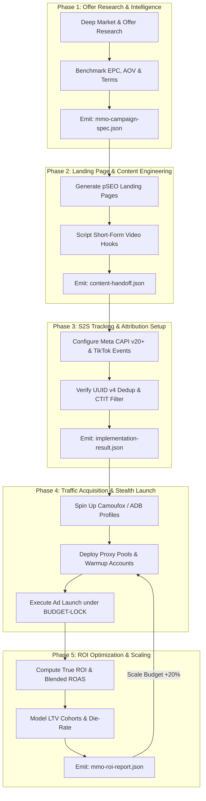

# MMO Growth Team Pack (`mmo-growth-team`)

> **Pack Version**: `5.0.0`  
> **Schema Version**: `2`  
> **Composition**: `core` only  
> **Primary Roles**: `@mmo-engineer`, `@seo-analyst`, `@content-writer`, `@data-analyst`, `@security-engineer`  
> **Core Workflows**: `mmo-campaign-lifecycle`, `seo-content-lifecycle`, `content-publishing`, `qa-validation`, `security-incident-response`  

---

## 1. Executive Overview & Operating Philosophy

The `mmo-growth-team` pack establishes a comprehensive, multi-agent swarm engineering standard for modern **Make Money Online (MMO)** operations. It marks an architectural paradigm shift from 2023-era fragmented proxyware farming, basic account botting, and spam content towards an enterprise-grade **Full-Spectrum Growth Engineering** ecosystem grounded in 2026/2027 state of the art (SOTA).

Modern online customer acquisition and affiliate monetization operate under aggressive adversarial constraints:
- **Privacy Sandboxes & Signal Loss**: Third-party cookies are fully deprecated in major browser engines; client-side pixels face >35% signal loss due to Safari ITP, Firefox ETP, Brave Shields, and mobile OS privacy regimes (iOS 18+ AdAttributionKit).
- **Advanced Behavioral Bot Detection**: Modern fraud defense systems (Cloudflare Turnstile, DataDome, PerimeterX, Akamai) analyze hardware-level WebGPU / Canvas noise consistency, JA3/JA4 TLS client hello fingerprints, and TCP/IP stack anomalies rather than simple User-Agent strings.
- **Generative Search & Answer Engines**: Search traffic capture has evolved beyond keyword stuffing into Programmatic SEO (pSEO) governed by Answer-First BLUF (Bottom Line Up Front) summaries, structured entity graphs, and dynamic live product feed integration.
- **Financial Risk & Amortization**: Ad platforms enforce strict account integrity policies. Sustainable profitability demands rigorous financial engineering factoring in blended multi-channel ROAS, customer lifetime value (LTV) cohort retention curves, proxy bandwidth costs, AI token overhead, and account die-rate depreciation.

The `mmo-growth-team` pack coordinates a specialized swarm of agents governed by cryptographic Server-to-Server (S2S) contracts, deterministic isolation boundaries (`ISOLATION-LOCK`), and automated financial circuit-breakers (`BUDGET-LOCK`).

---

## 2. The 5 Technical Clusters (2027 MMO SOTA Foundations)

The technical architecture of this pack is built upon five empirical research pillars:

### Cluster 1: AI-Native Affiliate & Review Engines
- **Direct Merchant Open APIs**: Direct integration with merchant and affiliate platforms including Amazon Creator Connections / PA-API v5, TikTok Shop Open Platform API, Shopee Open Platform API, and Lazada Open Platform.
- **Dynamic Pricing & Stock Feed Synchronization**: Real-time webhook listeners and scheduled cron syncs reconciling live product inventory, price drops, flash sales, and localized affiliate commission overrides.
- **Structured Semantic Entity Modeling**: Injection of validated JSON-LD schema graphs (`Product`, `Review`, `AggregateRating`, `Offer`) to optimize extraction by generative search engines and conversational AI overview engines.

### Cluster 2: Advanced S2S Tracking & Attribution
- **Multi-Channel Server Conversion Dispatch**: Direct server-to-server event dispatching to Meta Conversions API (CAPI v20+), TikTok Events API v1.3, and Google Ads Enhanced Conversions API with privacy-safe SHA-256 normalized user identifiers (`em`, `ph`, `gclid`, `wbraid`, `gbraid`, `ttclid`).
- **Cryptographic Event Deduplication**: Universal issuance of UUID v4 `event_id` tokens generated at edge gateway proxies (Cloudflare Workers) and propagated synchronously through client DOM and server postback pipelines.
- **Click-To-Install Time (CTIT) Anti-Fraud Filtering**: Immediate rejection of conversions occurring within < 2.5 seconds of click generation (scripted injection / IVT) and quarantine of conversions exceeding 7-day windows on impulse purchase funnels.
- **Affiliate Lifecycle Postbacks**: Webhook ingestion infrastructure supporting conversion, rebill, cancellation, and chargeback events with HMAC-SHA256 signature verification and idempotent message queuing.

### Cluster 3: 2026/2027 Stealth Automation & Anti-Detect Evasion
- **CDP over Anti-Detect Browsers**: Automation orchestration utilizing Chrome DevTools Protocol (CDP) connected to cloud/local Anti-Detect Browser engines (AdsPower, Dolphin{anty}, Multilogin) rather than easily fingerprinted headless Chrome bundles.
- **Native C++ Engine Patching (Camoufox)**: Utilization of browser binaries with internal C++ source modifications (Camoufox) to guarantee hardware-level WebGPU, WebGL, Canvas, and audio context noise consistency across repeated sessions.
- **TLS Client Hello & Network Fingerprint Matching**: Alignment of browser fingerprint signatures with operating system network traits, including JA3/JA4 hashes, HTTP/2 priority frames, and MTU packet characteristics.
- **Automated Challenge Resolution**: Human-like mouse spline kinematics (Bezier curves with velocity jitter) and token-injection handling for Cloudflare Turnstile and interactive captcha challenges.

### Cluster 4: Financial Engineering & Campaign Economics
- **True ROI Accounting**: Comprehensive net profitability modeling:
  $$\text{True ROI} = \frac{\text{Gross Revenue} - (\text{Ad Spend} + \text{Proxy Cost} + \text{AI API Cost} + \text{Die-Rate Cost} + \text{Banking Fees})}{\text{Total Cost}} \times 100$$
- **Blended ROAS & Marketing Efficiency Ratio (MER)**: Reconciling disparate traffic sources across paid ads, organic pSEO, and viral short-form media into unified blended return metrics.
- **Customer Lifetime Value (LTV) Cohort Projections**: 30/60/90-day cohort retention curve modeling for subscription affiliate offers, calculating exact payback periods to prevent premature halting of profitable campaigns.
- **Account Die-Rate Amortization**: Factoring asset attrition into cost structures as an amortized operational expense rather than unexpected capital losses.

### Cluster 5: Programmatic SEO & Faceless Media Arbitrage
- **Answer-First pSEO Landing Pages**: High-velocity generation of programmatic comparison and review pages featuring BLUF callouts (≤60 words, ≥3 numerical benchmarks) tailored for Google AI Overviews and Perplexity search indexes.
- **Multimodal Short-Form Video Hooks**: Automated scripting and prompt generation for TikTok, YouTube Shorts, and Instagram Reels emphasizing pattern interrupts, direct response psychological triggers, and frictionless affiliate bridge URLs.
- **CRO Direct-Response Copywriting**: Deployment of structured PAS (Problem-Agitate-Solve) and AIDA (Attention-Interest-Desire-Action) frameworks with strict verification preventing AI hallucinations of unvetted product capabilities.

---

## 3. The 100-Round MMO Deep Research Protocol

Before launching or scaling any campaign vertical, the swarm executes the **100-Round MMO Deep Research Protocol**. This empirical investigation protocol guarantees that campaigns are anchored in factual offer metrics and platform enforcement rules rather than generic assumptions.

```
┌─────────────────────────────────────────────────────────────────────────────┐
│                   100-ROUND MMO DEEP RESEARCH PROTOCOL                      │
├────────────────────────────────┬────────────────────────────────────────────┤
│ Cluster 1: Rounds 01 - 20      │ AI-Native Affiliate & Merchant APIs        │
│ Cluster 2: Rounds 21 - 40      │ Cookieless S2S Tracking, CAPI & Fraud      │
│ Cluster 3: Rounds 41 - 60      │ Stealth CDP Automation, Camoufox & WebGPU  │
│ Cluster 4: Rounds 61 - 80      │ True ROI, Blended ROAS & LTV Modeling      │
│ Cluster 5: Rounds 81 - 100     │ Programmatic SEO, Faceless Video & CRO     │
└────────────────────────────────┴────────────────────────────────────────────┘
```

### Research Hierarchy & Validation Standard
1. **Primary Documentation First**: Affiliate platform developer documentation, ad network API specifications, browser engine source commits, and statutory consumer protection policies.
2. **Empirical Benchmarks**: Live API test calls, proxy response latency audits, and testbed conversion postback validations.
3. **Persistent Dossier Generation**: Research outputs are compiled into:
   - `reports/research/mmo-2027-sota-dossier.json` (machine-readable metrics and endpoints)
   - `reports/research/mmo-2027-sota-research-notes.md` (structured analytical review)

---

## 4. The 5-Phase Multi-Agent Delivery Pipeline

The swarm executes campaigns through a deterministic 5-Phase pipeline. Transitions between phases require machine-validated contract schemas and explicit checklist sign-offs.



### Phase Gates & Exit Criteria

| Phase | Lead Role | Collaborators | Required Input | Emitted Output Contract | Gate Criteria |
|---|---|---|---|---|---|
| **1. Offer Research** | `@mmo-engineer` | `@researcher` | Offer URLs, vertical goals | `mmo-campaign-spec.json` | Valid EPC, non-deceptive terms, platform ToS alignment |
| **2. Content & Landing** | `@content-writer` | `@mmo-engineer` | Campaign specification | `content-handoff.json` | BLUF ≤60w, zero AI product hallucination, schema JSON-LD |
| **3. S2S Tracking** | `@mmo-engineer` | `@frontend-developer` | Domain & CDN access | `implementation-result.json` | Test conversion firing, UUID v4 match, EMQ score ≥8.0 |
| **4. Traffic Acquisition** | `@mmo-engineer` | `@security-engineer` | ADB profiles, proxies | `implementation-result.json` | 1:1:1 IP-profile-card isolation, WebGPU noise consistency |
| **5. ROI Optimization** | `@mmo-engineer` | `@data-analyst` | Ad spend & network postbacks | `mmo-roi-report.json` | True ROI > target threshold, die-rate amortized, CTIT clean |

---

## 5. Role Boundaries & Swarm Matrix

| Role | Primary Responsibilities | Strict Boundary (Does NOT Own) |
|---|---|---|
| **`@mmo-engineer`** | Campaign architecture, S2S conversion tracking, stealth CDP automation scripts, residential proxy pool management, asset isolation, True ROI modeling. | Production core app deployments, organizational security policies, broad company risk tolerance sign-offs. |
| **`@seo-analyst`** | Keyword clustering, search volume estimation, SERP competitor analysis, Answer-First structure validation, Schema.org graph audits. | Direct ad spend execution, ADB profile management, proxy routing. |
| **`@content-writer`** | High-converting direct-response copywriting, pSEO landing page text, multimodal short-video scripts, product comparison tables. | Tracking API endpoint wiring, proxy configuration, financial scaling decisions. |
| **`@data-analyst`** | Multi-channel attribution modeling, cohort LTV analysis, statistical anomaly detection, CTIT fraud clustering. | Automation script coding, ad account provisioning. |
| **`@security-engineer`** | Asset sharing RBAC review, VCC credential isolation audit, compliance boundary assessment, security incident containment. | Creative copy generation, ad creative design, campaign bidding strategy. |

---

## 6. Standard A2A Handoff Contracts

All inter-agent handoffs in this pack must adhere to structured JSON contracts validated via `Draft 2020-12` schemas located in `core/contracts/schemas/`:

1. **`contracts/schemas/mmo-campaign-spec.json`**
   - Defines vertical, merchant platform, payout structures, audience geos, programmatic landing parameters, S2S tracking endpoints (CAPI, TikTok Events, Google), stealth ADB profile specs, daily ad spend caps, and target blended ROAS.
   - Enforces discriminator: `"contract_type": "mmo-campaign-spec"`.

2. **`contracts/schemas/mmo-roi-report.json`**
   - Formulates audit periods, gross revenue breakdown (direct CPA, recurring rebills, overrides), operational cost stack (proxies, tokens, die-rate depreciation), net profit, True ROI percentage, Blended ROAS, Event Match Quality (EMQ), CTIT rejected counts, and actionable scaling directives.
   - Enforces discriminator: `"contract_type": "mmo-roi-report"`.

3. **`contracts/schemas/implementation-result.json`**
   - Documents deployed tracking endpoints, automation scripts, Docker/container configurations, and executed test payloads.

---

## 7. Operating Guardrails & Lock Directives

- **`ANONYMITY-LOCK`**: Origin server and residential IP footprints must never be leaked. All ad management and automation traffic must traverse validated residential or mobile proxy pools. Standard headless Chrome is strictly prohibited for high-risk operations.
- **`ISOLATION-LOCK`**: Enforce strict 1:1:1 compartmentalization across ad accounts, browser profiles, residential IPs, and virtual credit cards (VCC). Sharing assets across unrelated operations to prevent cascading bans ("chết chùm").
- **`TRACKING-LOCK`**: Never deploy paid traffic budget without verified Server-to-Server (S2S) postback telemetry and client-server UUID v4 event deduplication.
- **`BEHAVIORAL-LOCK`**: Automation scripts must execute organic human behavior simulations (variable mouse splines, non-zero typing jitter, realistic pause cadences). AI safety guardrail bypass (`bypass_ai_guardrail`) is strictly denied.
- **`REVIEW-SYSTEM LOCK`**: Any technique specifically intended to deceive or circumvent an advertising platform's review, moderation, or safety system requires explicit written user confirmation and Security Engineer sign-off.
- **`BUDGET-LOCK`**: Daily ad spend caps and API token utilization hard limits must be verified in platform consoles before activating campaigns.

---

## 8. Verification & Audit Tooling

To ensure zero drift and complete compliance with platform standards, run the following verification commands:

```bash
# 1. Verify pack manifest and includes integrity
python core/scripts/validate-packs.py

# 2. Verify all core schemas and bundled contract examples
python core/scripts/validate-contracts.py

# 3. Verify workflow structure, sequential steps, and role reachability
python core/scripts/validate-workflows.py

# 4. Verify index synchronization across INDEX.md and adapter registries
python core/scripts/generate-index.py --check

# 5. Execute full repository validation suite (all 17 gates)
python core/scripts/validate-all.py

# 6. Run comprehensive MMO pack empirical challenge test suite
pytest tests/test_mmo_pack_challenge.py -v
```

---

## 9. Invalidation Conditions

This master operating standard is invalidated and requires immediate revision if:
- Major advertising platforms (Meta, TikTok, Google) deprecate their current S2S Conversion APIs or alter UUID deduplication contracts.
- Antigravity adapter schemas or A2A 1.0 JSON-RPC protocols undergo breaking modifications.
- Browser engines eliminate CDP support or completely invalidate patched C++ anti-detect browser evasion techniques.
- Pack governance metadata or manifest schema version specifications are updated in `core/scripts/validate-packs.py`.
