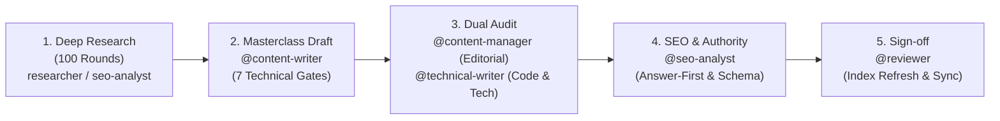

# Vesviet Content Team Pack (`vesviet-team`)

> Master Operating Standard & Multi-Agent Swarm for the Vesviet (`tanhdev.com`) and Learn (`learn.tanhdev.com`) twin Hugo technical knowledge bases.

---

## 1. Overview & Operating Philosophy

The `vesviet-team` pack composes the global engineering core with `overlays/vesviet-content` to orchestrate continuous, production-grade technical publishing across twin Hugo sites.

### The Twin Sites Architecture
- **Vesviet (`vesviet/`, `https://tanhdev.com/`)**:
  - Primary language: **English (`en`)**.
  - Role: **Flagship Portfolio & Global Citation Target**. High E-E-A-T engineering masterclasses, author entity proof (17+ years backend architecture), and consulting conversion (`hire.md`).
  - Target: GEO/AEO optimization for AI engines (ChatGPT, Perplexity, Claude, Google AI Overviews).
- **Learn (`learn/`, `https://learn.tanhdev.com/`)**:
  - Primary language: **Vietnamese (`vi`)**.
  - Role: **Technical Research Corpus & Deep Notes Twin**. In-depth technical series, Hugo Book documentation (`content/docs/`), and internal deep-research batch reports (`draft: true`).

### Core Authority Rules
1. **One-Way Authority Flow**: `learn` $\rightarrow$ `vesviet` only. Vietnamese posts link up to the English masterclass via `> 🇬🇧 Read the English version...`. **Links from `vesviet` to `learn` are strictly forbidden.**
2. **Canonical Independence**: Each site declares `canonicalURL` on its own domain. Never cross-canonicalize twins.
3. **Information Gain**: The English twin must provide unique information gain (expanded benchmarks, additional failure modes, international market context) beyond translation to comply with modern anti-duplication guidelines.

---

## 2. The 10 Anchor Pillar Hubs

All content on `vesviet` is structured around 10 Anchor Pillar Hubs to maintain a clean Hub-and-Spoke topology with **zero orphan pages**:

1. `posts/go-microservices.md` — Go & Microservices Architecture Hub
2. `posts/architecting-21-service-ecommerce-golang-ddd.md` — System Design & E-Commerce Hub
3. `posts/aws-eks-vs-ecs-comparison.md` — Cloud Native & Container Infrastructure Hub
4. `posts/banking-microservices-architecture.md` — FinTech & Core Banking Hub
5. `posts/cloudflare-d1-durable-objects-realtime-cart.md` — Edge Serverless & Cloudflare Hub
6. `posts/deploying-astro-on-cloudflare-full-stack-edge-architecture.md` — Modern Frontend & Edge Hub
7. `posts/generative-ui-with-mcp-ai-native-frontend.md` — Generative UI & WebMCP Hub
8. `posts/alipay-double-11-architecture-tps.md` — High Concurrency & Distributed Systems Hub
9. `reading-map.md` — Sitewide Curated Learning Directory (6 pillars)
10. `hire.md` — Commercial Architecture Consulting Hub

---

## 3. Mandatory 100-Round Deep Research Protocol

Before any new article is drafted or any existing article is upgraded, agents **MUST** execute 100 rounds of deep research across 5 technical clusters:

```
┌────────────────────────────────────────────────────────────────────────┐
│                   DEEP RESEARCH PROTOCOL (100 ROUNDS)                  │
├────────────────────────────────────────────────────────────────────────┤
│ Cluster 1: Architecture Roots, Whitepapers & Context    (Rounds 01-20) │
│ Cluster 2: Core Algorithms, Distributed Models & Math   (Rounds 21-40) │
│ Cluster 3: Quantitative Benchmarks & Hardware Setups    (Rounds 41-60) │
│ Cluster 4: Production Failures & Post-Mortem Realities  (Rounds 61-80) │
│ Cluster 5: Trade-off Framing & 2026-2027 SOTA Standards (Rounds 81-100)│
└───────────────────────────────────┬────────────────────────────────────┘
                                    │
                                    ▼
       Dossier Output: `reports/research/{slug}-dossier.{json,md}`
```

### Protocol Constraints:
- Every round must trace to a primary source (whitepaper, official RFC, GitHub repo release notes, conference talk, or live benchmarks).
- AI summaries may generate research queries, but must **NEVER** be cited as primary sources.
- Research outputs must be saved to `reports/research/<slug>-dossier.json` and mirrored in markdown format before drafting begins.

---

## 4. Multi-Agent Swarm Delivery Pipeline

Publishing and updating articles is governed by a specialized 4-role sequential pipeline:



### Role Breakdown:
1. **`@content-writer`**:
   - Drafts the article adhering to the **7 Technical Content Gates**:
     - *Gate 1*: Answer-First summary (`> **Answer-first:**` $\le 60$ words) + BLUF per H2.
     - *Gate 2*: Production-grade version-pinned code (zero pseudo-code).
     - *Gate 3*: Quantitative depth ($\ge 3$ verifiable data points per 500 words).
     - *Gate 4*: Architecture diagrams in valid Mermaid syntax (`mermaid: true`).
     - *Gate 5*: Standardized Production Failure story (`> 🔥 **[Production Failure]: ...**`).
     - *Gate 6*: Trade-off framing (competing options analyzed, alternatives rejected).
     - *Gate 7*: Primary-sourced claims and pinned library versions.
2. **`@content-manager`**:
   - Audits brand voice, TOC structure, E-E-A-T, and Information Gain.
   - Enforces the Non-Commodity Score and verifies cross-site twin differentiation.
3. **`@technical-writer`**:
   - Audits code snippet compilability, API accuracy, and parameter definitions.
   - Verifies Kubernetes manifests, Dockerfiles, and configuration fragments against official schemas.
4. **`@seo-analyst`**:
   - Audits Answer-First block brevity ($\le 60$ words).
   - Audits internal links ($\ge 3$ per article, linking to Anchor Pillar Hubs).
   - Enforces Schema.org JSON-LD (`TechArticle`, `Person`, `FAQPage`).
   - Verifies zero reverse-authority links (`vesviet` $\rightarrow$ `learn`).

---

## 5. Standard Handoff Contracts

All phase transitions emit structured A2A contracts:
- `contracts/schemas/research-report.json`: 100-round research evidence dossier.
- `contracts/schemas/content-handoff.json`: Article metadata, gate verdicts, word count, and internal links.
- `contracts/schemas/seo-audit-report.json`: 7-gate score, GEO extractability index, and schema verification.

---

## 6. Verification Commands

```bash
# Validate complete repository pack and rule compliance
python core/scripts/validate-all.py

# Verify pack manifest and index synchronization
python core/scripts/generate-index.py --check

# Audit Hugo content integrity across twin repos
python D:/myproject/vesviet/reports/check_posts.py
```
