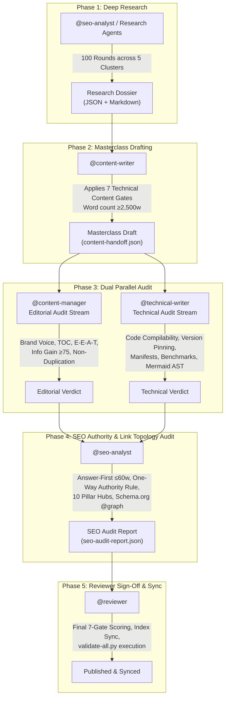

# Vesviet Content Team Pack (`vesviet-team`)

> **Master Operating Standard & Multi-Agent Swarm for the Vesviet (`tanhdev.com`) and Learn (`learn.tanhdev.com`) Twin Hugo Technical Knowledge Bases.**  
> **Pack Version**: 5.0.0 · **Schema Version**: "2" · **Baseline Snapshot**: 2026-09-18 · **Manifest**: [manifest.yaml](manifest.yaml)

---

## 1. Executive Overview & Operating Philosophy

The `vesviet-team` pack composes the global engineering core with `overlays/vesviet-content` to orchestrate continuous, production-grade technical publishing across twin Hugo sites. It enforces a research-first methodology, a 4-role multi-agent delivery pipeline, and the Technical Article Standard 2027.

### 1.1 The Twin Sites Architecture

The publishing ecosystem operates as an asymmetric twin model separating global authority citation from localized deep research:

```
┌─────────────────────────────────────────────────────────────────────────────────────────┐
│                              TWIN HUGO ARCHITECTURE                                      │
├─────────────────────────────────────────────────────────┬───────────────────────────────┤
│ learn.tanhdev.com (Research Twin)                      │ tanhdev.com (Authority Target)│
├─────────────────────────────────────────────────────────┼───────────────────────────────┤
│ Language: Vietnamese (`vi`)                             │ Language: English (`en`)      │
│ Role: Research notes, series library, internal dossiers │ Role: Global citation target, │
│ Theme: Hugo + PaperMod + Hugo Book (`content/docs/`)    │       flagship masterclasses, │
│ Canonical: `canonicalURL: https://learn.tanhdev.com/..` │       consulting conversion   │
│ Inbound: Receives search traffic for VI technical terms │ Canonical: `tanhdev.com/...`  │
│ Outbound: Links UP to English masterclasses via badge   │ Outbound: ZERO links to learn │
└──────────────────────────┬──────────────────────────────┴───────────────────────────────┘
                           │
                           │   ONE-WAY AUTHORITY FLOW ONLY
                           │   `learn` ───────────────► `vesviet`
                           │   (Zero reverse links allowed!)
                           ▼
```

- **Vesviet (`vesviet/`, `https://tanhdev.com/`)**:
  - **Primary Language**: English (`en`).
  - **Strategic Role**: Authority Flagship & AI Citation Anchor. Hosts evergreen, deeply grounded engineering masterclasses (>2,500 words, >20 KB), author entity proof (Lê Tuấn Anh, Senior Go Backend Architect with 17+ years experience in distributed systems, core banking, and high-concurrency e-commerce), and commercial architecture consulting conversion (`hire.md`).
  - **Target Optimization**: Generative Engine Optimization (GEO) and Answer Engine Optimization (AEO) for AI search engines (ChatGPT, Claude, Perplexity, Google AI Overviews).
- **Learn (`learn/`, `https://learn.tanhdev.com/`)**:
  - **Primary Language**: Vietnamese (`vi`).
  - **Strategic Role**: Technical Research Corpus & Engineering Twin. Hosts comprehensive 25-series libraries (251 files), Hugo Book documentation (`content/docs/`), and internal 100-round deep research batch reports (`draft: true`, `noTranslation: true`).
  - **Target Audience**: Domestic engineering readership, technical universities, and Vietnamese systems practitioners.

### 1.2 Core Authority & Topology Laws

1. **Strict One-Way Authority Flow (`learn` → `vesviet` only)**:
   - Authority flows strictly upward from the research twin to the flagship masterclass. Vietnamese articles on `learn` link up to the corresponding English flagship using standardized callout badges:
     ```markdown
     > 🇬🇧 **Read the English version of this article on [tanhdev.com](https://tanhdev.com/posts/<slug>/)**
     ```
   - **Zero Reverse Link Law**: Content on `vesviet` (`vesviet/content/**`) is **strictly forbidden** from linking down to `learn.tanhdev.com`. Reverse links dilute topical authority and fragment link equity. Any reverse link is a blocking gate failure caught by `vesviet/reports/check_posts.py`.
2. **Canonical Independence (Self-Referential Only)**:
   - Each site declares its own `canonicalURL` in frontmatter pointing to its own host domain:
     - `vesviet`: `canonicalURL: "https://tanhdev.com/posts/<slug>/"`
     - `learn`: `canonicalURL: "https://learn.tanhdev.com/posts/<slug>/"`
   - Cross-site canonicalization between twin domains is strictly prohibited. Both sites represent distinct, legitimate localized engineering assets.
3. **Information Gain Standard (Anti-Duplication)**:
   - English masterclasses on `tanhdev.com` must **never** be simple translations of Vietnamese research notes.
   - Under modern Search Spam Policies (Scaled Content Abuse), the English flagship must deliver **≥25% unique Information Gain** compared to both top-10 SERP results and the Vietnamese twin:
     - Expanded quantitative benchmarks with explicit hardware testbeds.
     - Additional production failure post-mortems and international operational contexts.
     - Standalone Mermaid architecture diagrams and C4 component topologies.
4. **Zero Orphan Policy**:
   - Every published article, chapter, or radar briefing must link upward to at least one Anchor Pillar Hub and receive inbound links from cluster siblings. Orphan pages (0 inbound links) are strictly blocked from release.

---

## 2. The 10 Anchor Pillar Hubs as Structural Backbone

All content on `vesviet` is structured into a strict Hub-and-Spoke topology anchored by 10 Anchor Pillar Hubs across core distributed systems and infrastructure domains:

| # | Technical Pillar Domain | Anchor Pillar Slug / File Path | Series Hub URL | Covered Subsystems & Engineering Scope | Topology Role & Link Equity Function |
|---|---|---|---|---|---|
| **1** | **Distributed Consensus & Raft** | `posts/alipay-double-11-architecture-tps.md` | `/series/raft/` | Multi-Paxos, Raft leader election, state machine replication (SMR), log compaction, split-brain prevention, quorum reads, Linearizable consistency | Core consensus anchor; aggregates all consensus, replication, and distributed state machine spokes. |
| **2** | **Kubernetes Deep Dive & Platform Engineering** | `posts/aws-eks-vs-ecs-comparison.md` | `/series/k8s/` | Control plane internals, Karpenter autoscaling, GitOps (ArgoCD), eBPF CNI networking, custom controller-runtime operators, multi-tenant scheduling | Infrastructure backbone; anchors containerization, cluster lifecycle, cloud TCO, and platform engineering spokes. |
| **3** | **Go High-Performance Concurrency & Microservices** | `posts/go-microservices.md` | `/series/golang/` | GMP scheduler mechanics, lock-free ring buffers, memory allocator internals (`runtime/malloc.go`), Go 1.25/1.26 `testing/synctest`, Green Tea GC, zero-alloc profiles | Primary Go language anchor; curates microservices patterns, concurrency primitives, and runtime profiling spokes. |
| **4** | **eBPF & Linux Kernel Observability** | `series/ebpf/_index.md` | `/series/ebpf/` | Linux kernel tracing, kprobes/uprobes, tracepoints, XDP packet filtering, Cilium/Tetragon security monitoring, BPF ring buffer telemetry | Observability and kernel telemetry anchor; curates low-level networking, security probes, and runtime monitoring spokes. |
| **5** | **High-Throughput Message Queues & Event Streaming** | `posts/banking-microservices-architecture.md` | `/series/kafka/` | Apache Kafka partition rebalancing, KRaft consensus quorum, transactional outbox pattern, RocketMQ peak shaving, exactly-once semantics (EOS) | Event-driven architecture anchor; governs event streaming, pub/sub reliability, financial ledgers, and messaging spokes. |
| **6** | **Modern Distributed Storage & LSM-Trees** | `posts/cloudflare-d1-durable-objects-realtime-cart.md` | `/series/storage/` | Log-Structured Merge-trees (LSM), LevelDB/RocksDB compaction, write amplification factor (WAF), Bloom filters, Cloudflare D1 distributed SQLite, Durable Objects | Storage engine anchor; unifies disk-bound databases, key-value stores, write-heavy ingestion, and edge state spokes. |
| **7** | **Zero-Trust Security & Service Mesh** | `series/service-mesh/_index.md` | `/series/service-mesh/` | Envoy sidecar proxies, Istio ambient mesh, SPIFFE/SPIRE cryptographic workload identity, mTLS automation, FAPI 2.0 security profiles | Network security anchor; connects zero-trust networking, identity federation, API gateways, and service mesh spokes. |
| **8** | **Database Internals & Query Optimization** | `posts/architecting-21-service-ecommerce-golang-ddd.md` | `/series/databases/` | B-Tree vs LSM indexing, MVCC storage engines, distributed ACID transactions, two-phase commit (2PC) alternatives, NewSQL architecture (OceanBase, TiDB) | Data management anchor; aggregates domain-driven design (DDD) persistence, query execution plans, and data modeling spokes. |
| **9** | **SRE, Chaos Engineering & Resiliency** | `series/sre/_index.md` | `/series/sre/` | Chaos Mesh fault injection, cascading failure isolation, adaptive rate limiting, circuit breakers, SLO/SLI error budget engineering, automated MTTR recovery | Reliability anchor; governs chaos experiments, incident post-mortems, high-availability architecture, and SRE spokes. |
| **10** | **AI Agent Swarms & LLM Infrastructure** | `posts/generative-ui-with-mcp-ai-native-frontend.md` | `/series/ai-agents/` | Model Context Protocol (MCP 2.0), streaming JSON-RPC contracts, multi-agent orchestration swarms, A2A communication, RAG vector indexing, Generative UI | Next-generation AI systems anchor; curates agentic workflows, LLM runtime serving, tool-use protocols, and generative UI spokes. |

### 2.1 Sitewide Navigation & Conversion Anchors

In addition to the 10 domain hubs, two sitewide anchor pages manage sitewide navigation and commercial intent:
- **`reading-map.md` (Sitewide Curated Learning Directory)**: Groups long-form engineering masterclasses into 6 specialized tracks (Commerce Modernization, 21-Service Go, Event Reliability, Platform Ops, AI Systems, Senior Leadership). Provides readers with clear progression routes and explicit information-gain signposting.
- **`hire.md` (Commercial Architecture Consulting Conversion Hub)**: Commercial conversion hub for Lê Tuấn Anh. Converts senior leadership and enterprise readers through verifiable technical track records: zero-downtime Magento-to-Go migrations, 25M+ requests/month scale, high-throughput financial architectures, and retainers for independent architecture reviews.

### 2.2 Hub-and-Spoke Link Topology Rules

1. **Mandatory Upward Link (Spoke to Hub)**: Every series chapter, radar briefing, or standalone article **MUST** include at least one contextual anchor link pointing up to its designated Anchor Pillar Hub.
2. **Curated Downward Link (Hub to Spoke)**: Each Anchor Pillar Hub must maintain a curated directory of its related spokes, organized logically by subsystem or engineering complexity.
3. **Lateral Cluster Cross-Linking**: Spokes within the same technical cluster must link laterally to related chapters using descriptive anchor text (e.g., anchor text such as *"Read Chapter 2: Outbox Pattern Implementation"* linking to `/series/kafka/chapter-02`).
4. **Orphan Elimination Enforcement**: Pre-publish crawler checks run via `vesviet/reports/check_posts.py`. A single orphan post (0 inbound internal links) results in immediate pipeline rejection.

---

## 3. The 100-Round Deep Research Protocol

Prior to drafting any new masterclass or upgrading an existing post, agents **MUST** complete 100 rounds of deep research structured across 5 technical clusters (20 rounds each). Research is not an informal search pass; it is a systematic evidence-gathering process producing verifiable dossiers.

```
┌──────────────────────────────────────────────────────────────────────────────────────────────────┐
│                             100-ROUND DEEP RESEARCH PROTOCOL                                      │
├───────────────────┬──────────────────────────────────────────────────────────────────────────────┤
│ Cluster 1         │ Architecture Roots, Whitepapers & Historical Context          (Rounds 01–20) │
├───────────────────┼──────────────────────────────────────────────────────────────────────────────┤
│ Cluster 2         │ Core Algorithms, Distributed Models & Complexity Analysis     (Rounds 21–40) │
├───────────────────┼──────────────────────────────────────────────────────────────────────────────┤
│ Cluster 3         │ Quantitative Benchmarks, Hardware Conditions & P95/P99        (Rounds 41–60) │
├───────────────────┼──────────────────────────────────────────────────────────────────────────────┤
│ Cluster 4         │ Production Outages, Real-World Failures & Post-Mortems        (Rounds 61–80) │
├───────────────────┼──────────────────────────────────────────────────────────────────────────────┤
│ Cluster 5         │ Trade-off Matrices, Alternatives Rejected & SOTA Standards    (Rounds 81–100)│
└───────────────────┴───────────────────────────────────────┬──────────────────────────────────────┘
                                                            │
                                                            ▼
                                   Dossier Output: `reports/research/{slug}-dossier.json`
                                                   `reports/research/{slug}-research-notes.md`
```

### 3.1 Cluster Breakdown (20 Rounds Each)

#### Cluster 1: Architecture Roots, Whitepapers & Historical Context (Rounds 01–20)
- **Objective**: Trace foundational concepts, original academic papers, architectural evolution, and first-principles constraints.
- **Inquiry Archetypes**:
  - *Rounds 01–05*: Original design whitepapers and official RFCs (e.g., Google Spanner, Raft consensus paper, Dynamo paper, IETF RFCs).
  - *Rounds 06–10*: First-principles problem formulation: what hardware limits or distributed failure modes necessitated this architecture?
  - *Rounds 11–15*: Historical lineage: what broke in prior architectures (e.g., why 2-Phase Commit failed at internet scale)?
  - *Rounds 16–20*: Creator retrospects, keynotes, and design proposals from foundational open-source repositories.
- **Required Primary Sources**: ACM/IEEE digital libraries, IETF RFCs, CNCF specifications, original author design documents.

#### Cluster 2: Core Algorithms, Distributed Models & Complexity Analysis (Rounds 21–40)
- **Objective**: Extract mathematical models, state machine transitions, formal proofs, and algorithmic complexity.
- **Inquiry Archetypes**:
  - *Rounds 21–25*: Core data structures (e.g., LSM-Tree memtable/SSTable compaction, H3 hexagonal spatial indexing, SkipLists).
  - *Rounds 26–30*: Distributed consensus & state replication protocols (Multi-Paxos, Raft term elections, Vector Clocks, CRDTs).
  - *Rounds 31–35*: Algorithmic time and space complexity ($O(1)$, $O(\log N)$, worst-case write amplification factors).
  - *Rounds 36–40*: Theoretical bounds and formal trade-offs (CAP theorem positioning, PACELC classification, Little's Law queues).
- **Required Primary Sources**: Engine source code (e.g., `etcd/raft`, Go runtime scheduler `runtime/proc.go`), formal algorithmic specifications.

#### Cluster 3: Quantitative Benchmarks, Hardware Conditions & Latency P95/P99 (Rounds 41–60)
- **Objective**: Gather empirical performance numbers under explicitly documented hardware and runtime conditions.
- **Inquiry Archetypes**:
  - *Rounds 41–45*: Peak throughput measurements (TPS, RPS, QPS) under linear concurrency ramps.
  - *Rounds 46–50*: Tail latency distributions: median (p50), 95th percentile (p95), 99th percentile (p99), and maximum jitter (p99.9).
  - *Rounds 51–55*: Memory allocation metrics: bytes per operation (`B/op`), heap allocations per operation (`allocs/op`), GC pause frequency.
  - *Rounds 56–60*: Strict hardware conditions: CPU model/cores (e.g., AMD EPYC 7763, Apple M3 Max), RAM capacity/channels, disk NVMe IOPS, network MTU, OS kernel version, compiler flags.
- **Required Primary Sources**: Reproducible benchmark suites, TechEmpower benchmarks, official project load-testing runs, verified author-run benchmarks.

#### Cluster 4: Production Outages, Real-World Failures & Post-Mortems (Rounds 61–80)
- **Objective**: Investigate real-world failure realities, cascading degradations, operational edge cases, and post-mortems.
- **Inquiry Archetypes**:
  - *Rounds 61–65*: High-profile public incident post-mortems (e.g., Cloudflare BGP route leaks, AWS Kinesis shard limits, GitHub database split).
  - *Rounds 66–70*: Concurrency bugs & race conditions: goroutine leaks, distributed deadlocks, split-brain scenarios, thundering herds.
  - *Rounds 71–75*: Resource exhaustion mechanisms: connection pool starvation, file descriptor leaks, kernel epoll saturation, OOM killer triggers.
  - *Rounds 76–80*: Operational recovery: circuit breaker trips, graceful degradation fallbacks, bulkheading blast radii, rollback execution timelines.
- **Required Primary Sources**: Incident post-mortems published by engineering organizations, CVE root-cause analyses, verified production incident logs.

#### Cluster 5: Trade-off Matrices, Alternatives Rejected & SOTA Standards (Rounds 81–100)
- **Objective**: Synthesize comparative trade-offs, document rejected alternatives, and establish alignment with 2026-2027 state-of-the-art standards.
- **Inquiry Archetypes**:
  - *Rounds 81–85*: Technology showdowns: Head-to-head comparison against the 2 closest market competitors (e.g., OSRM vs GraphHopper, Dapr vs Temporal).
  - *Rounds 86–90*: Formal decision matrices: Multi-variable evaluation across 5+ criteria (throughput, latency, operational complexity, cloud TCO, developer velocity).
  - *Rounds 91–95*: Modern 2026-2027 SOTA shifts (e.g., Go 1.25/1.26 `testing/synctest`, MCP 2.0 agentic mesh, eBPF Tetragon security, DeepSeek-V3 Multi-head Latent Attention).
  - *Rounds 96–100*: Information Gain synthesis: Documenting unique angles and first-hand insights missing from existing top-10 search results.
- **Required Primary Sources**: Comparative benchmark suites, vendor trade-off analyses, recent conference proceedings (e.g., QCon, GopherCon 2025/2026).

### 3.2 Source Credibility Hierarchy

Citations throughout technical content must adhere to strict credibility tiers:
- **Tier 1 (Primary Sources — Mandatory ≥70% of Citations)**: Official RFCs, peer-reviewed whitepapers, open-source engine source code, official release notes, reproducible benchmark logs.
- **Tier 2 (Secondary Sources — Allowed with Cross-Verification)**: Reputable engineering blogs (e.g., Uber Engineering, Netflix TechBlog, Cloudflare Blog), official cloud provider documentation.
- **Tier 3 (Tertiary Sources — Context Only, No Empirical Claims)**: Reference wikis, general tech portals, conceptual documentation.
- **Tier 4 (AI-Generated Content — STRICT QUERY-ONLY DISCIPLINE)**: AI search summaries (Perplexity, ChatGPT, Gemini) may be used **only** to discover candidate keywords and initial pointers. **AI summaries must NEVER be cited as primary sources.** Every claim discovered via AI must be verified against original source documentation via the Chain-of-Verification (`cove_log`).

### 3.3 Research Dossier Persistence & File Layout

All research findings must be serialized into persistent files before drafting begins:
1. **JSON Dossier (`reports/research/{slug}-dossier.json`)**: Machine-readable dossier conforming to [`core/contracts/schemas/research-report.json`](../../core/contracts/schemas/research-report.json) (Draft 2020-12). Contains `execution_metrics` (`depth_mode: "deep"`, `total_rounds: 100`), `raw_data_references`, `cove_log`, and `ai_source_discipline`.
2. **Markdown Research Notes (`reports/research/{slug}-research-notes.md`)**: Human-readable synthesis containing executive summary, per-cluster round logs (Rounds 01–100), and raw citation links.
3. **Batch Upgrade Reports on Learn**: When upgrading batches of 20 posts, consolidate into `learn/content/posts/deep-research-batch-N-100-rounds-report.md` with `draft: true` and `noTranslation: true`.

---

## 4. The 7 Technical Content Gates (Technical Article Standard 2027)

Every technical article or series chapter drafted or upgraded must satisfy all 7 Technical Content Gates. Gates 2, 6, and 7 are **Blocking**; failure halts publication immediately.

```
┌─────────────────────────────────────────────────────────────────────────────────┐
│                    THE 7 TECHNICAL CONTENT GATES 2027                           │
├────────┬──────────────────────────────────┬─────────────────────────────────────┤
│ Gate 1 │ Answer-First Engineering Summary │ BLUF ≤60 words + Atomic H2 BLUFs    │
├────────┼──────────────────────────────────┼─────────────────────────────────────┤
│ Gate 2 │ Production-Grade Code Only       │ Zero pseudo-code, version-pinned    │
├────────┼──────────────────────────────────┼─────────────────────────────────────┤
│ Gate 3 │ Quantitative Density             │ ≥3 verifiable data points / 500w    │
├────────┼──────────────────────────────────┼─────────────────────────────────────┤
│ Gate 4 │ Architecture Visualization       │ Mermaid diagrams (`mermaid: true`)  │
├────────┼──────────────────────────────────┼─────────────────────────────────────┤
│ Gate 5 │ Failure & Production Reality     │ Standardized Production Failure     │
├────────┼──────────────────────────────────┼─────────────────────────────────────┤
│ Gate 6 │ Trade-off Framing 2027           │ Alternatives rejected, >25% gain    │
├────────┼──────────────────────────────────┼─────────────────────────────────────┤
│ Gate 7 │ Verifiable Claims & Sourcing     │ Primary sources, CoVe audit trail   │
└────────┴──────────────────────────────────┴─────────────────────────────────────┘
```

### Gate 1: Answer-First Engineering Summary (BLUF ≤60 Words)
- **Criteria**:
  - Immediately following frontmatter, the article body must open with an Answer-First block:
    ```markdown
    > **Answer-first:** <Direct answer stating architectural decision, key constraint, and quantified outcome in ≤60 words.>
    ```
  - Prohibited: Slow-burn introductions ("In today's fast-paced microservices world..."), rhetorical questions, filler openings.
  - In addition, **every H2 section** must open with its own concise BLUF (Bottom-Line-Up-Front) in ≤60 words to enable atomic RAG chunking by AI engines.
- **Verification Method**: Extract text between `> **Answer-first:**` and next paragraph; verify word count $\le 60$. Check all `## ` headings for introductory BLUFs.

### Gate 2: Production-Grade Version-Pinned Code (Zero Pseudo-Code)
- **Criteria (BLOCKING)**:
  - **Zero Pseudo-Code**: No abstract stubs, no `// TODO: implement logic`, no `...` in functional code blocks.
  - **Complete & Compilable**: Every snippet must include complete imports, explicit error handling, context propagation (`ctx context.Context`), and graceful resource cleanup (`defer`, shutdown hooks).
  - **Version-Pinned**: Language and core frameworks must be explicitly stated in text and code headers (e.g., `// Go 1.26`, `// Kubernetes v1.31`, `// Dapr v1.15`).
  - **Deployable Configuration Manifests**: Kubernetes manifests, `wrangler.toml`, or Dockerfiles must be syntactically valid and deployable, never generic skeletons.
- **Verification Method**: Syntax dry-run compilation. Regex scan for prohibited placeholder patterns (`// TODO`, `// implement here`, `pass # placeholder`).

### Gate 3: Quantitative Density & Empirical Precision (≥3 Data Points / 500w)
- **Criteria**:
  - Body copy must maintain a minimum density of **≥3 verifiable empirical data points per 500 words** (throughput TPS/RPS, latency percentiles p50/p95/p99, memory allocation `B/op`, `allocs/op`, hardware specs, cost figures).
  - **Quantitative Comparison Tables**: Tables comparing technologies must contain concrete numerical metrics (e.g., Latency P99: 12ms vs 48ms, Allocs/op: 0 vs 14), never feature checkboxes (✔/✖).
  - **Hardware Condition Requirement**: Every benchmark cited must state the exact test environment: CPU model and core count, RAM capacity, disk storage type (e.g., NVMe Gen4), OS/kernel version, and runtime flags.
- **Verification Method**: $\text{Quantitative Density} = \frac{\text{Verifiable Data Points}}{\text{Word Count}} \times 500 \ge 3.0$.

### Gate 4: Architecture Visualization via Mermaid (`mermaid: true`)
- **Criteria**:
  - Every technical masterclass must feature at least one architectural diagram rendered in valid Mermaid syntax:
    - Sequence diagrams (`sequenceDiagram`) for distributed transaction flows and API handshakes.
    - Component/topology diagrams (`graph TD` or `graph LR`) for microservices networks and edge routing.
    - State diagrams (`stateDiagram-v2`) for complex entity lifecycles.
  - **Standalone Readability**: Diagrams must be completely understandable without reading accompanying text (all edges labeled with protocol/payload, nodes labeled with real service names, no "Service A" or "Box 1").
  - **Frontmatter Flag**: YAML frontmatter must include `mermaid: true`.
- **Verification Method**: Automated Mermaid parser validation to confirm 0 rendering errors. Check frontmatter contains `mermaid: true`.

### Gate 5: Production Reality & Standardized Failure Stories
- **Criteria**:
  - Every technical deep-dive must contain at least one real-world "Production Failure" post-mortem or concrete failure-mode breakdown using the standardized GitHub Markdown Alert template:
    ```markdown
    > 🔥 **[Production Failure]: <Descriptive Incident Title>**
    > **Symptom:** <Observed symptoms, triggered alerts, error spikes>
    > **Root Cause:** <Underlying concurrency race, memory leak, pool saturation>
    > 📊 **Impact:** <Downtime duration, dropped requests, financial/operational blast radius>
    > 📈 **Resolution:** <Immediate mitigation and permanent architectural fix>
    > *(Source: <Production post-mortem reference or author production experience>)*
    ```
  - **Operational Reality**: No pattern may be presented as "free". Must explicitly document operational costs, latency overhead, memory trade-offs, and rollback strategies.
- **Verification Method**: Regex verification of alert syntax and validation of all 5 required sub-fields (`Symptom`, `Root Cause`, `Impact`, `Resolution`, `Source`).

### Gate 6: Trade-off Framing & Information Gain (≥25% Unique Value)
- **Criteria (BLOCKING)**:
  - **Alternatives Rejected**: Every architectural decision must document what alternatives were considered and rejected, with explicit technical justification (e.g., "Selected NATS JetStream over Apache Kafka because...").
  - **Decision Matrices**: Any comparison of $\ge 3$ candidate technologies must provide a multi-variable decision matrix.
  - **Cross-Twin Information Gain**: The English flagship must deliver $\ge 25\%$ unique substantive value (expanded benchmarks, additional failure modes, international production context) over the Vietnamese twin notes. Pure translations are rejected.
- **Verification Method**: Audit presence of "Trade-offs & Alternatives Rejected" section. Content diff comparison between twin files.

### Gate 7: Verifiable Claims & Anti-Hallucination
- **Criteria (BLOCKING)**:
  - Every technical assertion, benchmark number, and architectural claim must trace directly to an empirical primary source recorded in the research dossier.
  - **Zero Raw Hallucinations**: No unsubstantiated generalizations ("Kubernetes is infinitely scalable").
  - **Version Pinning**: Version-sensitive statements must pin the exact release (e.g., "Go 1.25 synctest package", not "the latest Go testing features").
  - **Chain-of-Verification (CoVe)**: Critical claims must pass through the `cove_log` in `research-report.json`. Any claim lacking source backing must be explicitly disclosed as the author's own experimental measurement.
- **Verification Method**: Cross-check citations against `reports/research/{slug}-dossier.json`. AST link verification to confirm 0 broken links.

---

## 5. Multi-Agent Swarm Delivery Pipeline & Dual Parallel Audit

Content creation and upgrades are executed by a specialized 4-role sequential pipeline with dual parallel auditing in Phase 3:



### 5.1 Role Boundaries & Responsibilities

| Role | Primary Workflow Phase | Core Responsibilities & Audit Boundaries | Emitted Output Contract |
|---|---|---|---|
| **`@seo-analyst`** | Phase 1 & Phase 4 | **Phase 1**: Executes 100-round deep research across 5 clusters; builds primary-source citation index.<br>**Phase 4**: Audits Answer-First block brevity ($\le 60$ words), validates internal link topology ($\ge 3$ links, Anchor Pillar Hub connectivity), strictly enforces One-Way Authority Flow (0 links from `vesviet` to `learn`), and verifies Schema.org JSON-LD (`TechArticle`, `Person`, `FAQPage`). | `reports/research/{slug}-dossier.json`<br>`contracts/schemas/seo-audit-report.json` |
| **`@content-writer`** | Phase 2 | Transforms the 100-round research dossier into an authoritative engineering masterclass ($\ge 2,500$ words for masterclasses; $\ge 1,400$ words for standard posts). Implements all 7 Technical Content Gates directly in Markdown. | `contracts/schemas/content-handoff.json` |
| **`@content-manager`** | Phase 3 (Editorial) | Audits brand voice, structural heading hierarchy (H1 $\rightarrow$ H2 $\rightarrow$ H3), and author entity E-E-A-T signals. Audits Information Gain score ($\ge 75$): ensures English masterclass adds $\ge 25\%$ unique value over Vietnamese twin notes. Evaluates readability and cadence (anti-AI cliches, active voice $\ge 85\%$). | Editorial Sign-off Block in `content-handoff.json` |
| **`@technical-writer`** | Phase 3 (Technical) | Audits code correctness: verifies syntax, imports, context handling, and error checking. Verifies Kubernetes manifests, Dockerfiles, and Cloudflare configurations against official schemas. Validates benchmark conditions: ensures CPU, RAM, and runtime parameters are documented. Confirms Mermaid AST syntax. | Technical Sign-off Block in `content-handoff.json` |
| **`@reviewer`** | Phase 5 | Reviews dual audit findings; executes 7-gate scoring (`audit-technical-article`). Synchronizes corpus indexes (`learn/plan/CONTENT_INDEX.md` and `vesviet/reports/CONTENT_INDEX.md`). Runs `python core/scripts/validate-all.py` to ensure repository integrity before final human review. | Final PR Sign-Off & Index Refresh |

---

## 6. Standard A2A Handoff Contracts

All phase transitions emit structured contracts conforming to repository schemas in [`core/contracts/schemas/`](../../core/contracts/schemas/):

- **[`core/contracts/schemas/research-report.json`](../../core/contracts/schemas/research-report.json)**:
  - Emitted by: `@seo-analyst` (Phase 1).
  - Contents: `execution_metrics` (`depth_mode: "deep"`, `total_rounds: 100`), `synthesis`, `raw_data_references`, `cove_log` (Chain-of-Verification), and `ai_source_discipline`.
- **[`core/contracts/schemas/content-handoff.json`](../../core/contracts/schemas/content-handoff.json)**:
  - Emitted by: `@content-writer` (Phase 2), verified by `@content-manager` & `@technical-writer` (Phase 3).
  - Contents: Article metadata, 7-gate compliance verdicts, word count, code blocks inventory, internal link graph, and Information Gain score.
- **[`core/contracts/schemas/seo-audit-report.json`](../../core/contracts/schemas/seo-audit-report.json)**:
  - Emitted by: `@seo-analyst` (Phase 4).
  - Contents: Answer-first compliance score, GEO extractability index, internal links audit (Anchor Pillar Hub connectivity), zero-reverse-link check, and Schema.org validation.
- **[`core/contracts/schemas/content-audit-report.json`](../../core/contracts/schemas/content-audit-report.json)**:
  - Emitted by: `@reviewer` (Phase 5).
  - Contents: Sitewide corpus audit, zero-orphan verification, broken link scans, and live file count synchronization.

---

## 7. Verification & Audit Tooling

To independently verify pack integrity, adherence to rules, and index synchronization, execute the following commands from the repository root (`d:\myproject\agent-skills`):

```bash
# 1. Validate complete repository pack and rule compliance (all 17 validators)
python core/scripts/validate-all.py

# 2. Verify index synchronization across skills, contracts, roles, workflows, overlays, and packs
python core/scripts/validate-indexes.py

# 3. Check for stale generated index artifacts
python core/scripts/generate-index.py --check

# 4. Audit Hugo content integrity and zero-orphan enforcement across twin repos
python D:/myproject/vesviet/reports/check_posts.py
```

### Invalidation Conditions
This operating guide is invalidated if:
- Any of the 10 Anchor Pillar Hub paths are renamed or moved without updating the topology specification.
- The 5-cluster division of the 100-Round Protocol is altered from the 20-rounds-per-cluster structure.
- Reverse links from `vesviet` to `learn` are introduced.
- Canonical URLs are cross-linked between twin domains.
