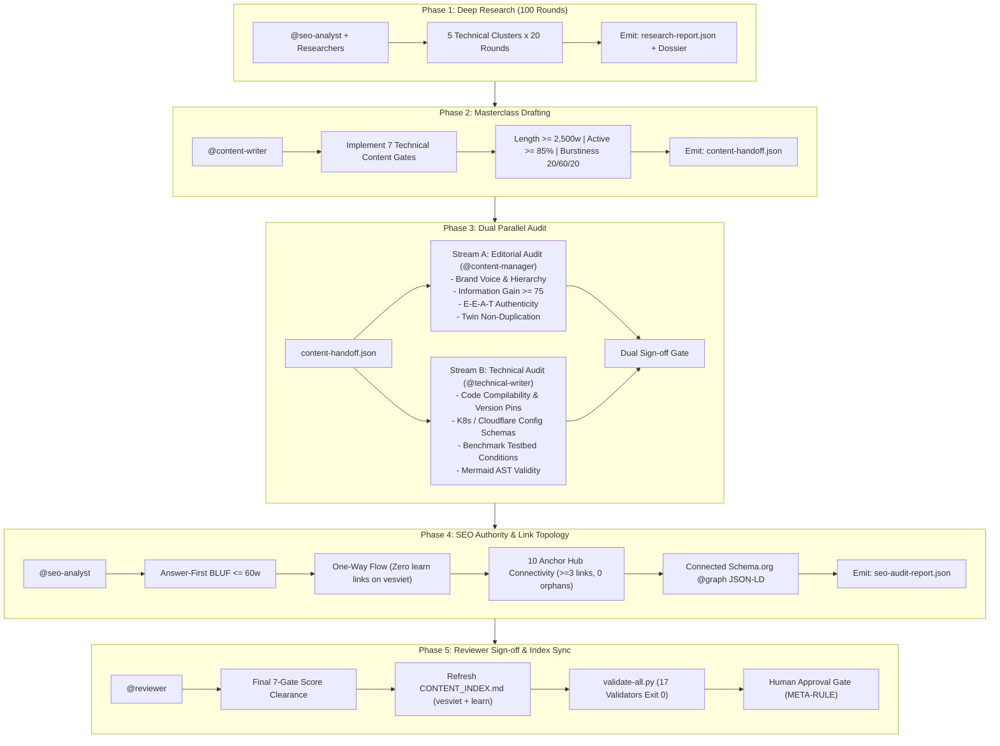

# Article Creation & Upgrade Lifecycle Workflow (`vesviet` + `learn`)

Use this workflow whenever a new technical article is drafted or an existing article is upgraded across the **Vesviet** (`tanhdev.com`) and **Learn** (`learn.tanhdev.com`) twin Hugo sites. It mandates a strict 100-round deep research protocol prior to drafting, orchestrates a specialized 4-role swarm delivery pipeline (`@content-writer`, `@content-manager`, `@technical-writer`, `@seo-analyst`, signed off by `@reviewer`), enforces non-overlapping audit boundaries, and validates all transitions via structured Agent-to-Agent (A2A) contracts.

---

## 1. Operating Architecture & Core Principles

The workflow operates under the twin Hugo architecture established in the `vesviet-team` v5.0.0 pack:

1. **The Twin Model**:
   - **Vesviet (`vesviet/`, `https://tanhdev.com/`)**: Primary English (`en`) flagship portfolio and global citation authority. Houses high-authority engineering masterclasses, practitioner proof (17+ years backend architecture), and commercial consulting pathways (`hire.md`). Optimized for generative AI engines (AEO/GEO).
   - **Learn (`learn/`, `https://learn.tanhdev.com/`)**: Primary Vietnamese (`vi`) technical research corpus and deep lab notes twin. Houses comprehensive technical series, Hugo Book documentation (`content/docs/`), and internal deep-research batch reports (`draft: true`).
2. **One-Way Authority Flow (`learn` $\rightarrow$ `vesviet`)**:
   - Authority flows strictly from `learn` to `vesviet`. Vietnamese articles on `learn` link up to the English masterclass via the standardized navigation badge:
     ```markdown
     > 🇬🇧 **Read the English version of this article on [tanhdev.com](https://tanhdev.com/posts/<slug>/)**
     ```
   - **Zero Reverse Links**: Links from `vesviet` to `learn.tanhdev.com` are strictly forbidden. Any outbound link from `vesviet` to `learn` constitutes an automatic gate failure.
3. **Canonical Independence**:
   - Every article declares `canonicalURL` on its own host domain. Never cross-canonicalize between twins (`tanhdev.com` points to itself; `learn.tanhdev.com` points to itself).
4. **Information Gain Moat**:
   - In compliance with modern anti-duplication guidelines, the English masterclass twin on `vesviet` must provide net-new information gain (e.g., expanded production failure analyses, hardware benchmark testbeds, or international architectural trade-offs) beyond word-for-word translation.

---

## 2. Preconditions

Before initiating this workflow, the following prerequisites must be verified:

1. **Article Scope & Target Designation**:
   - Unique slug and working title determined.
   - Target site explicitly assigned: `learn` (Vietnamese deep research twin), `vesviet` (English flagship masterclass), or a synchronized twin pair.
2. **Corpus Status & Anchor Mapping**:
   - Corpus status verified against `learn/plan/CONTENT_INDEX.md` and `vesviet/reports/CONTENT_INDEX.md`.
   - Upward anchor mapped to at least one of the **10 Anchor Pillar Hubs** (`rules/link-topology.md`):
     1. `posts/go-microservices.md` — Go & Microservices Architecture Hub
     2. `posts/architecting-21-service-ecommerce-golang-ddd.md` — System Design & E-Commerce Hub
     3. `posts/aws-eks-vs-ecs-comparison.md` — Cloud Native & Container Infrastructure Hub
     4. `posts/banking-microservices-architecture.md` — FinTech & Core Banking Hub
     5. `posts/cloudflare-d1-durable-objects-realtime-cart.md` — Edge Serverless & Cloudflare Hub
     6. `posts/deploying-astro-on-cloudflare-full-stack-edge-architecture.md` — Modern Frontend & Edge Hub
     7. `posts/generative-ui-with-mcp-ai-native-frontend.md` — Generative UI & WebMCP Hub
     8. `posts/alipay-double-11-architecture-tps.md` — High Concurrency & Distributed Systems Hub
     9. `reading-map.md` — Sitewide Curated Learning Directory Hub (6 pillars)
     10. `hire.md` — Commercial Architecture Consulting Hub
3. **Branch & Environment Cleanliness**:
   - Working on `main` branch under development integrity mode.
   - Clean working tree with zero uncommitted drift.

---

## 3. The 5-Phase Production Pipeline

Publishing new technical articles or upgrading existing posts follows a strict 5-phase sequential delivery pipeline:



---

### Phase 1: Deep Research (100 Rounds)

- **Owners**: `@seo-analyst` and specialized research agents.
- **Skills Activated**: `conduct-research`, `optimize-seo`.
- **Input**: Topic brief, target keywords, primary hypothesis, and target site assignment.
- **Protocol**: Execute 100 distinct research rounds structured into 5 technical clusters (20 rounds each):
  - **Cluster 1 (Rounds 01–20): Architecture Roots, Whitepapers & Context**: Original system designs, RFCs, foundational whitepapers, academic specifications, and historical evolution.
  - **Cluster 2 (Rounds 21–40): Core Algorithms, Distributed Models & Math**: Consensus algorithms (Raft, Paxos), formal state machines, time complexity, and distributed concurrency models.
  - **Cluster 3 (Rounds 41–60): Quantitative Benchmarks, Hardware Conditions & Latency P95/P99**: Empirical performance metrics, memory allocations (`allocs/op`), P50/P95/P99 latency profiles, throughput under load, and precise testbed hardware specifications.
  - **Cluster 4 (Rounds 61–80): Production Outages, Edge Cases & Failure Mode Retrospectives**: Real-world incident post-mortems, cascading failures, split-brain scenarios, thundering herds, and operational recovery paths.
  - **Cluster 5 (Rounds 81–100): Trade-off Matrices, Alternatives Rejected & SOTA 2026–2027 Standards**: Multi-dimensional decision matrices, competing architectures rejected with concrete rationale, and modern ecosystem patterns (Go 1.26, eBPF, WebMCP, Cloudflare Workers).
- **Protocol Constraints**:
  - **Tier 1 Primary Sourcing**: $\ge 70\%$ of citations must originate from primary sources (official RFCs, system architecture whitepapers, official GitHub repository releases, or author-conducted benchmark logs).
  - **AI Source Lock**: Generative AI tools may formulate search queries only. AI-generated summaries must **NEVER** be cited as primary sources or evidentiary support.
  - **Evidence Dossier Persistence**: Save findings to `reports/research/<slug>-dossier.json` and mirror in markdown at `reports/research/<slug>-research-notes.md`.
- **Handoff Contract Emitted**: `core/contracts/schemas/research-report.json`.
- **Quality Gate**: **DEPTH LOCK** — exactly 100 rounds recorded, `sources_analyzed >= 25`, `grounding_completeness_pct == 100`.

---

### Phase 2: Masterclass Drafting

- **Owner**: `@content-writer`.
- **Skills Activated**: `write-vesviet-learn-content`, `write-article`.
- **Input**: Validated `research-report.json` and research dossier from Phase 1.
- **Protocol**: Draft the article from the evidence dossier, rigorously satisfying all **7 Technical Content Gates** (`rules/technical-article-2027.md`):
  - **Gate 1: Answer-First Summary & Section BLUFs**:
    - Post opens immediately with `> **Answer-first:**` ($\le 60$ words) stating the architectural pattern, key constraint, and quantified outcome.
    - Every H2 section opens with its own Bottom Line Up Front (BLUF $\le 60$ words) for atomic RAG chunking; no slow-burn narrative intros.
  - **Gate 2: Production-Grade Version-Pinned Code**:
    - Zero pseudo-code. All code snippets must be complete, runnable, and version-pinned (e.g., Go 1.26, Kubebuilder v4, Dapr 1.15).
    - Conceptually compilable: includes package declarations, explicit imports, error handling, and `context.Context` propagation.
    - Configuration artifacts (Kubernetes manifests, Cloudflare `wrangler.toml`, Dockerfiles) must be deployable specifications.
  - **Gate 3: Quantitative Depth**:
    - Minimum 3 verifiable data points per 500 words with primary source citations.
    - Comparison tables must feature numeric criteria (P50/P95/P99 latency, TPS, allocs/op, $/request) rather than superficial feature checkboxes.
    - All benchmarks must state experimental conditions (CPU, RAM, OS, dataset size, runtime flags).
  - **Gate 4: Architecture Visualization**:
    - Valid Mermaid diagram syntax (`flowchart TD`, `sequenceDiagram`, `C4Context`).
    - Standalone readability: explicit component names and descriptive edge labels (no generic "Service A $\rightarrow$ Service B").
    - Hugo frontmatter must specify `mermaid: true`.
  - **Gate 5: Production Reality & Failure Analysis**:
    - Must incorporate at least one standardized Production Failure story using the official template:
      ```markdown
      > 🔥 **[Production Failure]: <Incident Title>**
      > **Symptom:** <What failed in production>
      > **Root Cause:** <Underlying technical defect or bottleneck>
      > 📊 **Impact:** <Quantitative downtime, data loss, or latency degradation>
      > 📈 **Resolution:** <Engineered fix and architectural mitigation>
      > *(Source: <Primary post-mortem citation or telemetry log>)*
      ```
  - **Gate 6: Trade-off Framing 2027**:
    - Every architectural recommendation must explicitly articulate competing options and why specific alternatives were rejected.
    - Multi-option comparisons must include structured trade-off matrices.
  - **Gate 7: Verifiable Claims & Anti-Hallucination**:
    - Every technical claim must trace to a verified citation in the research dossier.
    - Uncited figures must be explicitly labeled as the author's own measurements with conditions documented.
- **Word Count Targets**:
  - Flagship Masterclasses (`vesviet`): $\ge 2,500$ words ($> 20\text{ KB}$).
  - Deep Research Notes (`learn`): $\ge 1,400$ words.
- **Style & Anti-AI Formatting Standards**:
  - **Voice**: Active voice $\ge 85\%$.
  - **Burstiness**: Sentence rhythm standard deviation $\ge 6.0$ with 20/60/20 distribution (20% short $<10$w, 60% medium 10–25w, 20% complex $>25$w).
  - **Cliché Elimination**: 0 banned AI filler words ("delve", "tapestry", "revolutionize", "crucial", "leverage", "furthermore").
- **Handoff Contract Emitted**: `core/contracts/schemas/content-handoff.json` (`status: "draft_ready"`).
- **Quality Gate**: Self-check passed; `ai_semantic_flaw_score.flaw_score <= 15`, `active_voice_percentage >= 85`.

---

### Phase 3: Dual Parallel Audit (Editorial & Technical)

Phase 3 executes a dual parallel audit separating editorial strategy from engineering verification. Both streams must approve the draft before progression to Phase 4.

```
                     ┌────────────────────────────────────────┐
                     │   Phase 2: content-handoff.json Draft  │
                     └───────────────────┬────────────────────┘
                                         │
                    ┌────────────────────┴────────────────────┐
                    ▼                                         ▼
┌──────────────────────────────────────┐   ┌──────────────────────────────────────┐
│  Stream A: Editorial & Brand Audit   │   │  Stream B: Technical & Code Audit    │
│  Owner: @content-manager             │   │  Owner: @technical-writer            │
├──────────────────────────────────────┤   ├──────────────────────────────────────┤
│ • Brand voice & tone integrity       │   │ • Runnable code execution validity   │
│ • TOC & heading hierarchy (H1-H2-H3) │   │ • Exact dependency version pins      │
│ • Top 10 SERP Information Gain >= 75 │   │ • K8s/Cloudflare manifest schemas    │
│ • Twin differentiation vs learn      │   │ • Benchmark testbed condition audit  │
│ • E-E-A-T & SME author authenticity  │   │ • Mermaid AST & syntax compilation   │
└──────────────────┬───────────────────┘   └──────────────────┬───────────────────┘
                    │                                         │
                    └────────────────────┬────────────────────┘
                                         ▼
                     ┌────────────────────────────────────────┐
                     │          Dual Sign-off Gate            │
                     │  (Gate 2, 6, 7 failures are BLOCKING)  │
                     └────────────────────────────────────────┘
```

#### Stream A: Editorial & Brand Audit (`@content-manager`)
- **Skill Activated**: `audit-content`.
- **Responsibilities**:
  1. **Structure & Voice**: Review tone consistency, narrative flow, logical progression, and strict heading hierarchy (H1 $\rightarrow$ H2 $\rightarrow$ H3).
  2. **Top 10 SERP Information Gain**: Compare draft against existing top 10 search results. Calculate the Non-Commodity Information Gain Score (must be $\ge 75/100$). Reject generic skyscraper paraphrasing.
  3. **Twin Differentiation**: When auditing an English flagship on `vesviet`, verify that it provides tangible incremental value (international case studies, deeper failure modes, unique benchmarks) beyond the Vietnamese twin on `learn`.
  4. **E-E-A-T & SME Proof**: Verify author entity signals, practitioner experience claims, and citation provenance.
- **Negative Boundary**: `@content-manager` does NOT validate code syntax, test compilation, or audit Kubernetes/Cloudflare configuration files.

#### Stream B: Technical & Code Audit (`@technical-writer`)
- **Skills Activated**: `write-documentation`, `review-service`, `review-code`.
- **Responsibilities**:
  1. **Code Execution Validity**: Verify syntax, correct imports, context cancellation (`ctx.Done()`), error handling, and graceful termination across all code blocks.
  2. **Version Pinning Conformance**: Verify explicit dependency version pins (Go 1.26, Kubebuilder v4, Dapr 1.15, Cloudflare Workers runtime). Reject unpinned generic references.
  3. **Configuration Schema Validation**: Audit Kubernetes manifests, Dockerfile multi-stage builds, and Cloudflare `wrangler.toml` fragments against official schemas.
  4. **Benchmark Testbed Verification**: Verify that all quantitative claims specify CPU architecture, RAM, OS kernel, dataset scale, and latency percentiles (P50/P95/P99).
  5. **Mermaid AST Validation**: Verify diagram syntax compiles to a clean Abstract Syntax Tree (AST) without rendering errors, using concrete component identifiers.
- **Negative Boundary**: `@technical-writer` does NOT audit brand voice, SERP competitive differentiation, or search intent alignment.

- **Dual Sign-off Gate**: Both `@content-manager` and `@technical-writer` must approve the draft in `content-handoff.json`. Any failure in Gate 2 (code validity), Gate 6 (trade-offs), or Gate 7 (verifiable claims) is a **Blocking finding** that immediately returns the draft to Phase 2.

---

### Phase 4: SEO Authority & Link Topology Audit

- **Owner**: `@seo-analyst`.
- **Skills Activated**: `audit-technical-article`, `optimize-seo`.
- **Input**: Approved draft and dual sign-off from Phase 3.
- **Protocol**:
  1. **Answer-First BLUF Compliance**: Audit opening summary block to guarantee it is strictly $\le 60$ words, begins with `> **Answer-first:**`, and delivers direct architectural takeaway and metric proof. Verify per-H2 BLUFs.
  2. **One-Way Authority Rule Enforcement**:
     - Verify Vietnamese post on `learn` correctly includes the up-link badge to `tanhdev.com`.
     - **Verify ZERO `learn.tanhdev.com` links on `vesviet`**. Any cross-link from `vesviet` back to `learn` is a critical gate failure requiring immediate removal.
  3. **Canonical Independence**: Verify each site declares `canonicalURL` on its own domain; zero cross-host canonicalization.
  4. **10 Anchor Pillar Hub Connectivity**:
     - Confirm article contains $\ge 3$ contextual internal links.
     - Confirm at least one link anchors upward to one of the 10 Anchor Pillar Hubs.
     - Confirm **zero orphan pages** are introduced.
  5. **Connected Schema.org `@graph` JSON-LD**:
     - Verify structured microdata connecting `TechArticle`, `Person` (author entity), `FAQPage` (mirroring on-page FAQ), and `BreadcrumbList`.
  6. **GEO/AEO Extractability Audit**:
     - Verify GEO Extractability Index score is $\ge 80/100$.
     - Verify content formatting supports clean retrieval by AI crawlers (ChatGPT, Perplexity, Claude, Google SGE).
- **Negative Boundary**: `@seo-analyst` does NOT rewrite code snippets or alter brand voice.
- **Handoff Contract Emitted**: `core/contracts/schemas/seo-audit-report.json` and `core/contracts/schemas/seo-metadata.json`.
- **Quality Gate**: **SEO AUTHORITY CLEARANCE** — 0 critical issues, 0 reverse links, GEO score $\ge 80$, topical authority pillar link verified.

---

### Phase 5: Reviewer Sign-off & Index Synchronization

- **Owner**: `@reviewer`.
- **Skills Activated**: `review-code`, `audit-content`.
- **Input**: Final draft, approved `content-handoff.json`, and cleared `seo-audit-report.json`.
- **Protocol**:
  1. **7-Gate Final Scoring**: Execute complete verification pass confirming all 7 Technical Content Gates are satisfied with 0 blocking defects.
  2. **Corpus Index Synchronization**:
     - Update `learn/plan/CONTENT_INDEX.md` with new/upgraded Vietnamese post counts, word counts, and compliance state.
     - Update `vesviet/reports/CONTENT_INDEX.md` with new/upgraded English flagship counts, word counts, and compliance state.
  3. **Repository Validation Suite**:
     - Execute `python core/scripts/validate-all.py` from repository root.
     - All 17 validators must pass cleanly with exit code 0.
  4. **Human Oversight Gate**:
     - Stage completed changes for human review.
     - Strictly enforce the META-RULE from `core/rules/code.md`: no automated git commits or remote pushes without explicit user confirmation.
- **Quality Gate**: **FINAL REPOSITORY INTEGRITY** — 17/17 validators pass with 0 errors; corpus indexes synchronized.

---

## 4. Non-Overlapping Role Boundaries Matrix

To prevent role conflict, duplicated effort, or ambiguous accountability during swarm execution, audit responsibilities are strictly partitioned:

| Dimension / Quality Gate | Phase 2: Drafting (`@content-writer`) | Phase 3: Editorial Audit (`@content-manager`) | Phase 3: Technical Audit (`@technical-writer`) | Phase 4: SEO & Topology Audit (`@seo-analyst`) |
| :--- | :--- | :--- | :--- | :--- |
| **Research Sourcing** | Synthesizes provided dossier into draft narrative | Verifies SME quote provenance & digital footprint | Validates benchmark testbed hardware conditions | Co-executes Phase 1 100-round research protocol |
| **Tone & Brand Voice** | **Drafts**: Active voice $\ge 85\%$, burstiness 20/60/20, zero clichés | **Audits**: Brand voice consistency, no marketing fluff | *No audit responsibility* | *No audit responsibility* |
| **Information Gain** | Implements unique architectural POV & telemetry | **Audits**: Non-Commodity Score $\ge 75$ vs Top 10 SERP | *No audit responsibility* | Analyzes SERP consensus gap in brief |
| **Twin Relationship** | Drafts VI notes or EN flagship | **Audits**: Verifies EN flagship adds value beyond translation | *No audit responsibility* | **Audits**: Zero reverse links & canonical independence |
| **Code & Configs** | Implements version-pinned, runnable snippets | *No audit responsibility* | **Audits**: Syntax, imports, context, K8s manifests, Dockerfiles | *No audit responsibility* |
| **Benchmarks & Math** | Injects $\ge 3$ data points / 500 words | Verifies business relevance & logic | **Audits**: Verifies hardware, dataset, latency P95/P99 | Audits quantitative table formatting |
| **Mermaid Diagrams** | Creates diagrams (`mermaid: true`) | Checks conceptual narrative clarity | **Audits**: Validates syntax, AST compliance, real labels | Verifies frontmatter `mermaid: true` |
| **Answer-First BLUF** | Writes `> **Answer-first:**` block | Checks answer clarity & substance | *No audit responsibility* | **Audits**: Word count $\le 60$w, entity salience, RAG chunking |
| **Link Topology** | Injects $\ge 3$ internal links from brief | Checks learning path relevance | *No audit responsibility* | **Audits**: Anchor Pillar Hub link, zero reverse links, 0 orphans |
| **Schema.org Microdata**| Formats FAQ block (`## FAQ`) | *No audit responsibility* | Validates tool schema definitions | **Audits**: Validates connected `@graph` JSON-LD |
| **Index Synchronization**| *No responsibility* | Tracks editorial calendar status | *No responsibility* | Verifies crawler zero-orphan count |

### Explicit Negative Boundaries

- **`@content-writer` Does NOT**: Self-approve drafts, invent benchmark numbers without research backing, or skip the 100-round research dossier.
- **`@content-manager` Does NOT**: Inspect Go compiler errors, validate Kubernetes manifest syntax, or perform SEO crawler sweeps.
- **`@technical-writer` Does NOT**: Rewrite narrative voice, evaluate search volume, or judge brand tone.
- **`@seo-analyst` Does NOT**: Rewrite code implementations or modify editorial storytelling.

---

## 5. Structured A2A Handoff Contracts

All phase transitions are mediated by structured JSON contracts conforming to schemas in `core/contracts/schemas/`:

```
Phase 1: Deep Research ──────► core/contracts/schemas/research-report.json
                                      │
                                      ▼
Phase 2: Masterclass Drafting ──► core/contracts/schemas/content-handoff.json
                                      │
                                      ▼
Phase 3: Dual Audit ─────────► [Annotated content-handoff.json (status: approved)]
                                      │
                                      ▼
Phase 4: SEO Authority Audit ──► core/contracts/schemas/seo-audit-report.json
                                      │
                                      ▼
Phase 5: Sign-off & Refresh ──► Updated CONTENT_INDEX.md + validate-all.py
```

### 5.1 Phase 1 Contract: `research-report.json`
- **Schema**: `core/contracts/schemas/research-report.json`
- **Discriminator**: `contract_type: "research-report"`
- **Key Assertions**:
  - `execution_metrics.depth_mode`: `"deep"`
  - `execution_metrics.total_rounds`: `100` (exactly 100 rounds across 5 clusters)
  - `execution_metrics.sources_analyzed`: $\ge 25$ primary sources
  - `raw_data_references`: Tier 1 primary source URLs (RFCs, whitepapers, Git release notes)
  - `information_gain.unique_insights`: Net-new angles absent in Top 10 SERP
  - `information_gain.firsthand_evidence_available`: `true`
  - `cove_log`: Chain-of-Verification log verifying factual statements
  - `ai_source_discipline.grounding_completeness_pct`: `100` (zero AI citations)

### 5.2 Phase 2 Contract: `content-handoff.json`
- **Schema**: `core/contracts/schemas/content-handoff.json`
- **Discriminator**: `contract_type: "content-handoff"`
- **Key Assertions**:
  - `handoff_id`: `"YYYY-MM-DD-<slug>"`
  - `site`: `"vesviet"` or `"learn"`
  - `content_path`: Repo-relative path to the Hugo post (e.g., `vesviet/content/posts/<slug>.md`)
  - `status`: `"draft_ready"`
  - `word_count`: $\ge 2,500$ (masterclass) or $\ge 1,400$ (research notes)
  - `information_gain.gate_passed`: `true`
  - `geo_aeo_fields_applied.answer_first_implemented`: `true` ($\le 60$ words)
  - `geo_aeo_fields_applied.fact_density_met`: `true` ($\ge 3$ data points per 500w)
  - `ai_semantic_flaw_score.flaw_score`: $\le 15$
  - `ai_semantic_flaw_score.active_voice_percentage`: $\ge 85$
  - `ai_semantic_flaw_score.cliche_count`: `0`
  - `internal_links_added`: Array of $\ge 3$ internal links
  - `recommended_next_roles`: `["content-manager", "technical-writer"]`

### 5.3 Phase 3 Endorsement: Annotated `content-handoff.json`
- Both `@content-manager` and `@technical-writer` review and endorse the handoff artifact.
- `status` updated to `"approved"`.
- Dual approval signatures recorded in `editorial_passes` and verification notes.

### 5.4 Phase 4 Contract: `seo-audit-report.json`
- **Schema**: `core/contracts/schemas/seo-audit-report.json`
- **Discriminator**: `contract_type: "seo-audit-report"`
- **Key Assertions**:
  - `audit_type`: `"pre_publish"`
  - `traditional_seo.internal_links_audit.passes`: `true` ($\ge 3$ links present)
  - `topical_authority_audit.pillar_page_link_present`: `true` (anchored to 1 of 10 hubs)
  - `ai_extractability.answer_first_structure.status`: `"pass"` ($\le 60$w)
  - `ai_extractability.overall_score`: $\ge 80$
  - `schema_compliance_audit.types_validated`: `["TechArticle", "Person", "FAQPage", "BreadcrumbList"]`
  - `handoff.status`: `"approved_to_publish"`

---

## 6. Workflow Linkages

This lifecycle workflow serves as the core delivery engine, interconnecting with three specialized operational workflows in the `vesviet-team` pack:

### 6.1 `masterclass-batch-upgrade.md`
- **Purpose**: Batch modernization of existing architecture posts (reference: Batches 1–5, 70 posts upgraded).
- **Linkage**: Employs the 100-round deep research protocol partitioned across 5 clusters (20 rounds each), mapped 1:1 to groups of 4 target posts (20 posts per batch).
- **Execution**: Emits an internal research batch report on `learn` (`deep-research-batch-N-100-rounds-report.md` with `draft: true`), then executes Phase 2 through Phase 5 of this lifecycle workflow for each of the 20 target posts.

### 6.2 `series-sync-upgrade.md`
- **Purpose**: Chapter-by-chapter synchronized twin upgrades for entire Hugo series (reference: `prompt-standard` with 251 series files).
- **Linkage**: Unlike batch upgrades, executes the full 100-round research protocol **per chapter** (1 dossier per chapter).
- **Execution**: Coordinates baseline series content indexes (`<series>-content-index.md`), chapter-by-chapter drafting on `learn`, English flagship authoring on `vesviet`, documentation hygiene by `@technical-writer`, and campaign close with Hugo `--minify` AST validation.

### 6.3 `content-audit-refresh.md`
- **Purpose**: Quarterly technical debt remediation and link topology governance for `vesviet`.
- **Linkage**: Identifies and remediates underperforming content to feed into this lifecycle workflow:
  - *Sprint 1 (Schema & GEO)*: Injects Answer-First blocks and repairs Schema.org metadata across the top 50 posts.
  - *Sprint 2 (Technical Depth)*: Identifies posts under 1,400 words and triggers Phase 2 drafting upgrades.
  - *Sprint 3 (Link Topology)*: Sweeps repo crawler to eliminate orphans and inject upward links to the 10 Anchor Pillar Hubs.
  - *Sprint 4 (Consolidation)*: Consolidates thin content ($<1,000$w) and configures 301 Permanent Redirects under explicit user confirmation.

---

## 7. Failure Modes & Mitigations

| # | Failure Scenario | Detection Point | Responsible Role | Enforced Mitigation |
|---|---|---|---|---|
| 1 | **Drafting without Research Dossier** | Phase 2 Pre-check | `@content-writer` | **Block Drafting**: Author is strictly prohibited from drafting without validated `research-report.json`. |
| 2 | **Pseudo-code or Missing Context (Gate 2)** | Phase 3 Stream B | `@technical-writer` | **Blocking Rejection**: Code snippet using placeholder logic or unpinned libraries returns draft to Phase 2 for runnable code. |
| 3 | **Commodity Skyscraper Copy (< 75 Score)** | Phase 3 Stream A | `@content-manager` | **Editorial Rejection**: Paraphrased competitor content without net-new telemetry or production post-mortems is rejected. |
| 4 | **Translation-Only English Twin** | Phase 3 Stream A | `@content-manager` | **Twin Gate Rejection**: English draft on `vesviet` that merely translates Vietnamese notes without additional value is blocked. |
| 5 | **Reverse Authority Link (`vesviet` $\rightarrow$ `learn`)** | Phase 4 Audit | `@seo-analyst` | **Zero-Tolerance Removal**: Any `learn.tanhdev.com` link on `vesviet` triggers immediate build rejection. |
| 6 | **Cross-Site Canonicalization** | Phase 4 Audit | `@seo-analyst` | **Configuration Rejection**: Any post pointing `canonicalURL` across hosts is rejected; must be self-referential. |
| 7 | **Orphan Spoke Page (< 3 Links or Disconnected)** | Phase 4 Audit | `@seo-analyst` | **Topology Rejection**: Crawler detection of $<3$ links or missing Anchor Pillar Hub link blocks publish. |
| 8 | **Stale Corpus Indexes on Merge** | Phase 5 Sign-off | `@reviewer` | **Index Lock**: Task cannot close until `CONTENT_INDEX.md` files on both `learn` and `vesviet` reflect new post counts and word totals. |

---

## 8. Standard 2026/2027 Alignment

This workflow strictly adheres to the repository-wide engineering standards:

- **OWASP ASI Guardrails**:
  - **ASI01 (Goal Hijack Prevention)**: Article briefs and technical scopes are strictly bound to declared Hugo taxonomy and architectural targets.
  - **ASI06 (Context Poisoning Defense)**: Generative AI summaries are strictly banned from primary research citations (Tier 1 Primary Sources $\ge 70\%$).
  - **ASI09 (Trust Exploitation Defense)**: Author credentials and practitioner claims are bound to real-world experience profiles via Schema.org `Person`.
- **Action Boundaries**: Governed by `core/policies/action-boundaries.yaml` (read/write limits strictly enforced).
- **Skill Toolbox Lock**: All workflow actions are executed exclusively by tagged roles whose Skill Toolbox lists the required skills as Primary.
- **Commit & Publish Gate**: Strictly enforces the META-RULE from `core/rules/code.md` — no automated git commits, remote pushes, or production deployments without explicit user confirmation.
